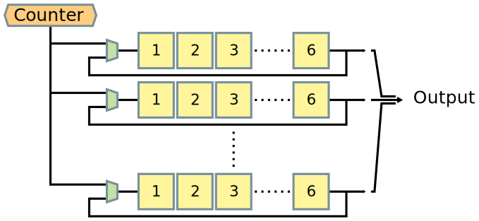
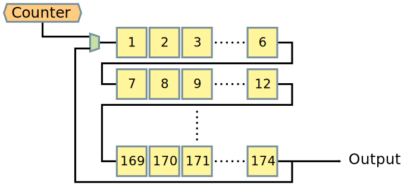
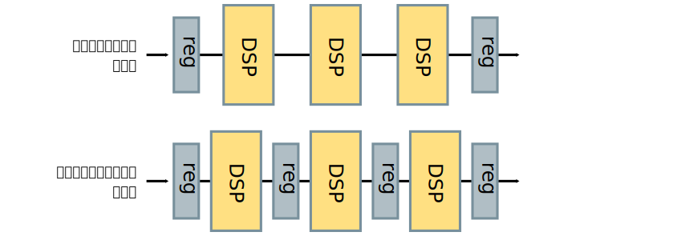
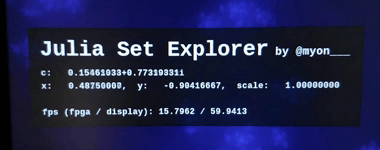

以前 [Ultra96 で Julia set をぐりぐり動かせるやつ](/entry/2019/05/15/ultra96-julia-set-explorer/) ([GitHub](https://github.com/Tosainu/ultra96-fractal)) の紹介をしました。この時点で当初作ろうとしていたものをだいたい実現できていたのですが、満足していない箇所もいくつかありました。

今回それらの点を改善して性能をあげたり、機能を追加したりしました。どんな感じに強くなったのかを紹介していきます。

<blockquote class="twitter-tweet tw-align-center"><p lang="ja" dir="ltr">一度 HDL 書く開発してみたいなーってことで冬・春に HLS で書いたのを SystemVerilog で書き直してた。<a href="https://t.co/h7HXFqsaHa">https://t.co/h7HXFqsaHa</a> と比較して動作クロック3倍 (100➡300MHz)、描画速度2.67倍 (6➡16fps) に改善できて、色も変えれるようになった。 <a href="https://t.co/GoizfFcpYa">pic.twitter.com/GoizfFcpYa</a></p>&mdash; ✧*。ヾ(｡˃﹏˂｡)ﾉﾞ。*✧ (@myon___) <a href="https://twitter.com/myon___/status/1163835624710795264?ref_src=twsrc%5Etfw">August 20, 2019</a></blockquote> <script async src="https://platform.twitter.com/widgets.js" charset="utf-8"></script>

<!--more-->

## 描画パイプラインの改善

前回 Vivado HLS で実装した Julia set 描画回路は、僕の Vivado HLS 力の不足で「ぼくのかんがえたさいきょうの Julia set レンダリングパイプライン」にすることができていませんでした。

今までのパイプラインを簡単に図にするとこんな感じです。$f_c(z)$ を1度だけ評価する浅いパイプライン (6ステージと仮定) を持つ回路を、性能を稼ぐために複数並べている構造になっていました。



このため出力ポートが24bit ✕ 32並列で 768bit と、とても広くなっていました。[雑に Vivado HLS で書いた回路](https://github.com/Tosainu/ultra96-fractal/blob/v0.0.2/hls_ip/data_width_converter/data_width_converter.cc)を挟んでデータを分割したりはしていましたがそれでも扱いづらかったですし、データがそんなに速くないのにこのデータ幅に対応させるためオーバースペックな周辺回路と接続する必要があり、性能面やリソース使用量の面でも微妙でした。

これを解決して「ぼくのかんがえたさいきょうの Julia set レンダリングパイプライン」にするために、回路の複製をやめ、$f_c(z)$ を何度か評価する深いパイプラインにしました。図にするとこんな感じです。



このようなパイプラインにすることで、前述したパイプラインと同程度の並列度を確保しつつ出力データ幅を1回路分に抑えることができます。実際には様々な要因によるリソースの増加[^res]の関係で HLS 版より並列度を32から29へ落とすことになり、クロックあたりの描画性能は15%ほど若干落ちてしまいましたが、無駄に大きな周辺回路と接続する必要などもなくとても扱いやすくなりました。

ちなみに、これを実現するため SystemVerilog での書き直しをしています。現状の実装が[こんな感じ](https://github.com/Tosainu/ultra96-fractal/blob/6a761b5facba503c95e770bc72bd3383dd1909f6/src/fractal_generator.sv)です。1度 HDL をガリガリ書く開発をしてみたいなと思っていたのと、目的の回路がある程度イメージできているなら HLS コンパイラの気持ちを考えながら `pragma` を追加したり書き方を変えていくより直接書いていったほうが楽だろうという判断です。前回 Vivado HLS で試せるだけのことはやったのでこれ以上の対処が思いつかなかったからというのもあります。

[^res]: 乗算処理のパイプライン化などにより DSP Slice の使用量が増加したため (32bit 乗算器1つあたり3 :arrow_right: 4)、回路の簡略化のため実際には256回以上 $f_c(z)$ を評価しているため、Vivado HLS が行っていた過度のリソースシェアリングを行っていないため、など

## 描画回路の動作クロック改善

[UltraScale Architecture DSP Slice User Guide](https://www.xilinx.com/support/documentation/user_guides/ug579-ultrascale-dsp.pdf) に書かれているように、DSP Slice を使った乗算回路はパイプライン化で性能向上と低消費電力化が可能で、そのような使い方を推奨しています。しかし前回実装した Julia set 描画回路は、Ultra96 で利用可能な DSP Slice のほぼ全てを使うほどの乗算回路を含んでいるにもかかわらず、その全てがパイプライン化されていない、組み合わせ回路として実装されていました。そのため、せいぜい 100MHz 程度で動作させるのが限界でした。



動作クロックの改善は性能に大きく関わります。そこで、前述したパイプラインの改善と並行して描画回路の動作クロック向上も行いました。

乗算回路のパイプライン化はそんなに難しくはありません。Vivado HLS なら [`RESOURCE` ディレクティブで `latency` を指定したり `core` に `MulnS` を指定する](https://www.xilinx.com/support/documentation/sw_manuals/xilinx2019_1/ug902-vivado-high-level-synthesis.pdf#page=172) ことでできるようです。VHDL や Verilog など各種 HDL であれば、[AR# 8657](https://www.xilinx.com/support/answers/8657.html) で紹介されているように、乗算処理の入力と出力に適切な数のレジスタを挿入することで、いい感じに合成してくれます。Verilog の例を引用するとこんな感じです。

> ```verilog
> module pipelined_multiplier ( a, b, clk, pdt);
> /*
> * parameter 'size' is the width of multiplier/multiplicand;.Application Notes 10-5
> * parameter 'level' is the intended number of stages of the
> * pipelined multiplier;
> * which is typically the smallest integer greater than or equal
> * to base 2 logarithm of 'size'
> */
> parameter size = 16, level = 4;
> input [size-1 : 0] a;
> input [size-1 : 0] b;
> input clk;
> output [2*size-1 : 0] pdt;
> reg [size-1 : 0] a_int, b_int;
> reg [2*size-1 : 0] pdt_int [level-1 : 0];
> integer i;
> 
> assign pdt = pdt_int [level-1];
> 
> always @ (posedge clk)
> begin
>   // registering input of the multiplier
>   a_int <= a;
>   b_int <= b;
>   // 'level' levels of registers to be inferred at the output
>   // of the multiplier
>   pdt_int[0] <= a_int * b_int;
>   for(i =1;i <level;i =i +1)
>     pdt_int [i] <= pdt_int [i-1];
> end // always @ (posedge clk)
> 
> endmodule // pipelined_multiplier
> ```

しかしパイプラインの段数を適切に設定してやらないと十分な性能を発揮してくれません。じゃあどの程度の値を指定すればいいのかの資料などを見つけることはできませんでしたが、Synthesis 時にレジスタが不足している とこんな感じの Info レベルのメッセージが出るので、その値を参考にすればよさそうでした。

    INFO: [Synth 8-5845] Not enough pipeline registers after wide multiplier. Recommended levels of pipeline registers is 4 [mul.sv:22]

これらの取り組みにより、動作クロックは 300MHz まで上げることができ、描画性能は 16fps くらいまで出るようになりました。Vivado の Timing report を見た感じまだ余裕がありそうなので、機会があればもっと高いクロックでの動作を目指してみたいです。

## ステータス表示の実装

前回紹介した時点では未実装で適当な値が表示されていたステータス表示部分をちゃんと実装しました。



## 表示アプリケーションを libdrm + Mesa GBM ベースに変更

前回紹介した時点ではなにか特別な設定をしていたわけではないので、表示アプリを起動するために Weston Terminal から `fractal-explorer` コマンドを実行するなどの手間が必要でした。せっかくなら Ultra96 の電源を入れたら何もせず表示アプリが起動するようにしたいところです。

いろいろ調べてみたものの、Weston で任意のアプリケーションをいい感じに自動起動させる方法は無さそうでした。表示アプリを IME として扱う Hack や Weston module を作る方法なども検討しましたが、うーん...

しかし改めて考えてみると、実装した表示アプリの画面表示部分は OpenGL/EGL で書いていますし、操作するためのゲームパッドの入力も自前で処理しているので、「Wayland への依存ほとんどないのでは？」となります。ということで表示アプリを Weston 上で動かす Wayland client として実装するのをやめ、Linux をブートさせた後 libdrm や Mesa GBM を使って接続されているディスプレイに直接 OpenGL/EGL の context を作ってそこに表示するような実装へ変更しました。自動起動は [weston-init](https://layers.openembedded.org/layerindex/recipe/90245/) パッケージの実装を参考に、`/etc/init.d/` 下に[サービス](https://github.com/Tosainu/ultra96-fractal/blob/6a761b5facba503c95e770bc72bd3383dd1909f6/petalinux_project/project-spec/meta-user/recipes-apps/fractal-explorer/files/init)を作ることで実現しました。

libdrm や GBM の扱い方に関するドキュメント等はあまり豊富ではありません。しかし次のようなコメントが豊富な参考実装が結構あり、それがとても参考になりました。

- [docs/drm-howto at master · dvdhrm/docs](https://github.com/dvdhrm/docs/tree/master/drm-howto)
- [tutorials/drm-gbm.c at master · eyelash/tutorials](https://github.com/eyelash/tutorials/blob/master/drm-gbm.c)
- [Miouyouyou/Linux_DRM_OpenGLES.c](https://gist.github.com/Miouyouyou/89e9fe56a2c59bce7d4a18a858f389ef)

## まとめ

今回 HDL を使った実装も行ったことで、この「Ultra96 で Julia set をぐりぐり動かせるやつ」を通して近年の FPGA に関わる主要な開発方法をひと通り経験することになりました。新たに知ることが多くてとても楽しかったですし、良い経験だったなと思います。コンピュータアーキテクチャに再び大きな注目がされつつある[^2]時代でもありますし、このような開発が趣味レベルでももっと流行ると面白いのではないかなと思っています。

[^2]: <https://cacm.acm.org/magazines/2019/2/234352-a-new-golden-age-for-computer-architecture/fulltext>
