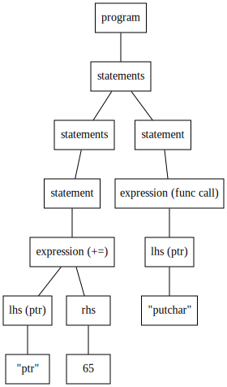

コンパイラやインタプリタは、プログラミングをするときほぼ必ず使うことになる重要なソフトウェアです。その原理ついては大学の講義で学んだことのある人も多いのではないでしょうか。

とはいえ、原理を学んだところでそれがシュッと実装できるかはコンパイラに限らずそうではない場合が多いと思います。僕もその1人でした。コンパイラの講義や Haskell でパーサコンビネータを実装した流れからコンパイラの実装に興味を持ったものの、どの程度の機能をどう実装するかに悩んでなかなか進まず、結局ほかにもやりたいことがあるからと有耶無耶になってしまった経験があったりします。

最近ふと「そういえば [Brainf\*\*k](https://en.wikipedia.org/wiki/Brainfuck) の処理系って書いたことなかったな」と思い、以前読んで気になっていた [itchyny さんのブログ記事](https://itchyny.hatenablog.com/entry/2017/02/27/100000)を参考にしながら Brainf\*\*k を LLVM IR にするコンパイラのようなものを実装してみたことがありました。

<blockquote class="twitter-tweet tw-align-center"><p lang="ja" dir="ltr">Brainf**k の処理系って未だに書いたことないなーってことで、インタプリタと LLVM IR を出力するコンパイラみたいなの書いてた <a href="https://t.co/FlSdpxU3yX">https://t.co/FlSdpxU3yX</a></p>&mdash; +。:.ﾟ٩(๑＞◡＜๑)۶:.｡+ﾟ (@myon___) <a href="https://twitter.com/myon___/status/1167413225211625472?ref_src=twsrc%5Etfw">August 30, 2019</a></blockquote> <script async src="https://platform.twitter.com/widgets.js" charset="utf-8"></script>

これが数時間もしないうちに実装できてしまったことにまず驚きます。そして Brainf\*\*k コンパイラの実装を眺めていると、コンパイラを構成する要素でいうところのコード生成に相当するものではないかということに気づき更に衝撃を受けます。ただ Brainf\*\*k の処理系を書いていたつもりが、いつの間にかコンパイラの一部を、しかも比較的短時間で実装していたのです。

僕はプログラミングを完全に理解しているわけではないので、何かしらの処理をプログラムするときに、まずどのような感じになるかをイメージしやすくするための最小限の実装から始めることがよくあります[^coding]。コンパイラもそうすればよかったのです。小さなプログラミング言語？ Brainf\*\*k だ！Brainf\*\*k レベルに機能を制限しつつも見慣れた構文を持つプログラミング言語 ([これ](https://github.com/masarakki/nyaruko_lang) みたいな Brainf\*\*k の命令を別の文字列に置換しただけの言語ではない) を設計し、それを認識する字句解析や構文解析などを実装していけば、とりあえずコンパイラを構成する要素を一通り実装できるのではないか。そんなモチベーションで始めた自作コンパイラ [chiya](https://github.com/Tosainu/chiya) をどのように実装したかの紹介をしていきます。

[^coding]: 具体的な設計などの前に「こんな感じの処理ってプログラムできるかなー」とか「このライブラリ使えないかなー」とかを確認する実装をしたりします

<!--more-->

## 準備

chiya は [Rust](https://www.rust-lang.org/) で実装しました。記事執筆時点でのツールチェインのバージョンは次のとおりです。

    $ rustup --version
    rustup 1.20.2 (2019-10-16)

    $ rustup show active-toolchain
    stable-x86_64-unknown-linux-gnu (default)

    $ rustc --version
    rustc 1.38.0 (625451e37 2019-09-23)

    $ clang --version
    clang version 9.0.0 (tags/RELEASE_900/final)
    Target: x86_64-pc-linux-gnu
    Thread model: posix
    InstalledDir: /usr/bin

プロジェクト[^project]は以下のように作成し、ライブラリと実行ファイルを含むようにしてみました。

    $ cargo new --lib chiya

    $ mkdir -p src/bin
    $ cat > src/bin/chiya.rs <<EOS
    fn main() {
        println!("Hello, World!");
    }
    EOS

    $ cargo run
       Compiling chiya v0.1.0 (/path/to/work/dir/chiya)
        Finished dev [unoptimized + debuginfo] target(s) in 1.45s
         Running `target/debug/chiya`
    Hello, World!

[^project]: Rust 的には package ってワードのほうが良さそうかも <https://doc.rust-lang.org/book/ch07-01-packages-and-crates.html>

## Brainf\*\*k レベルのコード生成を実装する

まずは本記事のきっかけともいえる、 Brainf\*\*k の各命令に対応する LLVM assembly language (LLVM IR[^llvm_ir]) を生成する処理から実装します。最初にこんな感じの `trait` を [`src/codegen/emitter.rs`](https://github.com/Tosainu/chiya/blob/c8a26f5cebf89fa41edde83e23873a4837a55d3f/src/codegen/emitter.rs) に実装しました。

[^llvm_ir]: [公式リファレンス](http://releases.llvm.org/9.0.0/docs/LangRef.html#abstract) を見た感じ "LLVM assembly language" や "LLVM language" が正式名称？っぽいけど、この記事では "LLVM IR" と書くことにします

```rust
pub trait Emitter {
    // ptr を offset 進める
    fn emit_move_ptr(&mut self, offset: i32) -> String;

    // *ptr に n 加算する
    fn emit_add(&mut self, n: i32) -> String;

    // putchar() を呼ぶ
    fn emit_call_putchar(&mut self) -> String;

    // getchar() を呼ぶ
    fn emit_call_getchar(&mut self) -> String;

    // ループのはじまり
    fn emit_loop_begin(&mut self) -> String;

    // ループのおわり
    fn emit_loop_end(&mut self) -> String;

    // 生成するコードのヘッダ
    fn emit_header(&self) -> String;

    // 生成するコードのフッタ
    fn emit_footer(&self) -> String;
}
```

続いて [`src/codegen/llvm.rs`](https://github.com/Tosainu/chiya/blob/0142dec5700759efb7b50ee1284fe42e81add906/src/codegen/llvm.rs) にこんな感じのデータ型 `LLVM` を定義しました。各フィールドは与えたソースコード全体のコードを生成するにあたって必要となる情報で、`variable_idx` は次に登場する無名変数のインデックス (LLVM IR で計算の途中結果などを格納する変数 ([Unnamed values](http://releases.llvm.org/9.0.0/docs/LangRef.html#identifiers)) は `%1`, `%2` ... と[登場する順に1からカウントしていく必要がある](http://releases.llvm.org/9.0.0/docs/LangRef.html#functions))、`label_idx` はループで使われるラベルのインデックス、`loop_stack` は今どのループの中にいるかを管理するためのものです。このデータ型に先程定義した `Emitter` のメソッドを生やしていきます。

```rust
use std::collections::VecDeque;

pub struct LLVM {
    variable_idx: u32,
    label_idx: u32,
    loop_stack: VecDeque<u32>,
}

impl LLVM {
    pub fn new() -> LLVM {
        Default::default()
    }
}

impl Default for LLVM {
    fn default() -> Self {
        LLVM {
            variable_idx: 1,
            label_idx: 1,
            loop_stack: VecDeque::new(),
        }
    }
}
```

上で紹介した itchyny さんのブログ記事などと同様に、目的の動作を C で書いて、それがどのような LLVM IR になるかを `clang` で確認しながら実装していく方針で進めました。例えば次のポインタ `ptr` の加算と `ptr` が指す値への加算をする処理は

```c
int main() {
  int* ptr;
  ++ptr;
  ++*ptr;
}
```

`clang -O0 -S --emit-llvm` の出力によればこんな感じの LLVM IR になるようなので

```llvm
; ModuleID = 'test.c'
source_filename = "test.c"
target datalayout = "e-m:e-i64:64-f80:128-n8:16:32:64-S128"
target triple = "x86_64-pc-linux-gnu"

; Function Attrs: noinline nounwind optnone sspstrong uwtable
define dso_local i32 @main() #0 {
  %1 = alloca i32*, align 8
  %2 = load i32*, i32** %1, align 8
  %3 = getelementptr inbounds i32, i32* %2, i32 1
  store i32* %3, i32** %1, align 8
  %4 = load i32*, i32** %1, align 8
  %5 = load i32, i32* %4, align 4
  %6 = add nsw i32 %5, 1
  store i32 %6, i32* %4, align 4
  ret i32 0
}

attributes #0 = { noinline nounwind optnone sspstrong uwtable "correctly-rounded-divide-sqrt-fp-math"="false" "disable-tail-calls"="false" "less-precise-fpmad"="false" "min-legal-vector-width"="0" "no-frame-pointer-elim"="true" "no-frame-pointer-elim-non-leaf" "no-infs-fp-math"="false" "no-jump-tables"="false" "no-nans-fp-math"="false" "no-signed-zeros-fp-math"="false" "no-trapping-math"="false" "stack-protector-buffer-size"="8" "target-cpu"="x86-64" "target-features"="+cx8,+fxsr,+mmx,+sse,+sse2,+x87" "unsafe-fp-math"="false" "use-soft-float"="false" }

!llvm.module.flags = !{!0, !1, !2}
!llvm.ident = !{!3}

!0 = !{i32 1, !"wchar_size", i32 4}
!1 = !{i32 7, !"PIC Level", i32 2}
!2 = !{i32 7, !"PIE Level", i32 2}
!3 = !{!"clang version 9.0.0 (tags/RELEASE_900/final)"}
```

`emit_move_ptr()` と `emit_add()` の実装はこうなる、という感じです。

```rust
use crate::codegen::emitter;

impl emitter::Emitter for LLVM {
    fn emit_move_ptr(&mut self, offset: i32) -> String {
        let s = format!(
            r#"
  ; emit_move_ptr({2})
  %{0} = load i32*, i32** %ptr, align 8
  %{1} = getelementptr inbounds i32, i32* %{0}, i32 {2}
  store i32* %{1}, i32** %ptr, align 8"#,
            self.variable_idx,
            self.variable_idx + 1,
            offset
        );
        self.variable_idx += 2;

        s
    }

    fn emit_add(&mut self, n: i32) -> String {
        let s = format!(
            r#"
  ; emit_add({3})
  %{0} = load i32*, i32** %ptr, align 8
  %{1} = load i32, i32* %{0}, align 4
  %{2} = add nsw i32 %{1}, {3}
  store i32 %{2}, i32* %{0}, align 4"#,
            self.variable_idx,
            self.variable_idx + 1,
            self.variable_idx + 2,
            n
        );
        self.variable_idx += 3;

        s
    }

    // ...
}
```

そのほかの実装は長くなるので、ここでは割愛します。

### とりあえず動かしてみる

ここまでで Brainf\*\*k の各命令に対応する LLVM IR を出力できるようになったはずです。最初のコンパイラっぽい動作確認に、Brainf\*\*k のソースコードを読み込み、LLVM IR に変換して出力する Brainf\*\*k コンパイラを書いてみます。

[`src/bin/chiya.rs`](https://github.com/Tosainu/chiya/blob/777b7b8b9243604aa6d1ea6a72d038b73a413a7d/src/bin/chiya.rs) にこんな感じのコードを書きました。標準入力を `src` に全部読み込み、その文字列を 1 文字ずつ見て対応するコードを出力する、というものです。

```rust
use std::io::Read;

use chiya::codegen::emitter::Emitter;
use chiya::codegen::llvm::LLVM;

fn main() -> std::io::Result<()> {
    let mut src = String::new();
    std::io::stdin().read_to_string(&mut src)?;

    let mut e = LLVM::new();

    println!("{}", e.emit_header());
    for c in src.chars() {
        let l = match c {
            '>' => e.emit_move_ptr(1),
            '<' => e.emit_move_ptr(-1),
            '+' => e.emit_add(1),
            '-' => e.emit_add(-1),
            '.' => e.emit_call_putchar(),
            ',' => e.emit_call_getchar(),
            '[' => e.emit_loop_begin(),
            ']' => e.emit_loop_end(),
            _ => continue,
        };
        println!("{}", l);
    }
    println!("{}", e.emit_footer());

    Ok(())
}
```

まずはとても簡単な `A` を出力するだけのコードを入力し、出力された LLVM IR を LLVM インタプリタの [`lli`](http://releases.llvm.org/9.0.0/docs/CommandGuide/lli.html) で実行してみます。

    $ echo '+++++++++++++++++++++++++++++++++++++++++++++++++++++++++++++++++.' | cargo run -q | lli
    A

[Wikipedia に載っている Hello World!](https://en.wikipedia.org/wiki/Brainfuck#Hello_World!) でもチェック。

    $ cargo run -q < hello_with_comments.bf | lli
    Hello World!

[Erik Bosman さんの Mandelbrot set プログラム](https://rosettacode.org/wiki/Mandelbrot_set#Brainf.2A.2A.2A) だと...

    $ cargo run -q < mandelbrot.bf | lli
    AAAAAAAAAAAAAAAABBBBBBBBBBBBBBBCCCCCCCCCCCCCCCCCCCCCCCCCCCCCCCCCCCCDDDDDDDDDEGFFEEEEDDDDDDCCCCCCCCCBBBBBBBBBBBBBBBBBBBBBBBBBBBBBB
    AAAAAAAAAAAAAAABBBBBBBBBBBBBCCCCCCCCCCCCCCCCCCCCCCCCCCCCCCCCCCCDDDDDDDDDDEEEFGIIGFFEEEDDDDDDDDCCCCCCCCCBBBBBBBBBBBBBBBBBBBBBBBBBB
    AAAAAAAAAAAAABBBBBBBBBBBBCCCCCCCCCCCCCCCCCCCCCCCCCCCCCCCCCCDDDDDDDDDDDDEEEEFFFI KHGGGHGEDDDDDDDDDCCCCCCCCCBBBBBBBBBBBBBBBBBBBBBBB
    AAAAAAAAAAAABBBBBBBBBBCCCCCCCCCCCCCCCCCCCCCCCCCCCCCCCCCCDDDDDDDDDDDDDDEEEEEFFGHIMTKLZOGFEEDDDDDDDDDCCCCCCCCCBBBBBBBBBBBBBBBBBBBBB
    AAAAAAAAAAABBBBBBBBBCCCCCCCCCCCCCCCCCCCCCCCCCCCCCCCCCCDDDDDDDDDDDDDDEEEEEEFGGHHIKPPKIHGFFEEEDDDDDDDDDCCCCCCCCCCBBBBBBBBBBBBBBBBBB
    AAAAAAAAAABBBBBBBBCCCCCCCCCCCCCCCCCCCCCCCCCCCCCCCCCDDDDDDDDDDDDDDDEEEEEEFFGHIJKS  X KHHGFEEEEEDDDDDDDDDCCCCCCCCCCBBBBBBBBBBBBBBBB
    AAAAAAAAABBBBBBBCCCCCCCCCCCCCCCCCCCCCCCCCCCCCCCCCDDDDDDDDDDDDDDDEEEEEEFFGQPUVOTY   ZQL[MHFEEEEEEEDDDDDDDCCCCCCCCCCCBBBBBBBBBBBBBB
    AAAAAAAABBBBBBCCCCCCCCCCCCCCCCCCCCCCCCCCCCCCCCDDDDDDDDDDDDDDDEEEEEFFFFFGGHJLZ         UKHGFFEEEEEEEEDDDDDCCCCCCCCCCCCBBBBBBBBBBBB
    AAAAAAABBBBBCCCCCCCCCCCCCCCCCCCCCCCCCCCCCCCCDDDDDDDDDDDDDDEEEEFFFFFFGGGGHIKP           KHHGGFFFFEEEEEEDDDDDCCCCCCCCCCCBBBBBBBBBBB
    AAAAAAABBBBCCCCCCCCCCCCCCCCCCCCCCCCCCCCCCCDDDDDDDDDDDDEEEEEFGGHIIHHHHHIIIJKMR        VMKJIHHHGFFFFFFGSGEDDDDCCCCCCCCCCCCBBBBBBBBB
    AAAAAABBBCCCCCCCCCCCCCCCCCCCCCCCCCCCCCCDDDDDDDDDDDEEEEEEFFGHK   MKJIJO  N R  X      YUSR PLV LHHHGGHIOJGFEDDDCCCCCCCCCCCCBBBBBBBB
    AAAAABBBCCCCCCCCCCCCCCCCCCCCCCCCCCCCCDDDDDDDDEEEEEEEEEFFFFGH O    TN S                       NKJKR LLQMNHEEDDDCCCCCCCCCCCCBBBBBBB
    AAAAABBCCCCCCCCCCCCCCCCCCCCCCCCCCCDDDDDDEEEEEEEEEEEEFFFFFGHHIN                                 Q     UMWGEEEDDDCCCCCCCCCCCCBBBBBB
    AAAABBCCCCCCCCCCCCCCCCCCCCCCCCCDDDDEEEEEEEEEEEEEEEFFFFFFGHIJKLOT                                     [JGFFEEEDDCCCCCCCCCCCCCBBBBB
    AAAABCCCCCCCCCCCCCCCCCCCCCCDDDDEEEEEEEEEEEEEEEEFFFFFFGGHYV RQU                                     QMJHGGFEEEDDDCCCCCCCCCCCCCBBBB
    AAABCCCCCCCCCCCCCCCCCDDDDDDDEEFJIHFFFFFFFFFFFFFFGGGGGGHIJN                                            JHHGFEEDDDDCCCCCCCCCCCCCBBB
    AAABCCCCCCCCCCCDDDDDDDDDDEEEEFFHLKHHGGGGHHMJHGGGGGGHHHIKRR                                           UQ L HFEDDDDCCCCCCCCCCCCCCBB
    AABCCCCCCCCDDDDDDDDDDDEEEEEEFFFHKQMRKNJIJLVS JJKIIIIIIJLR                                               YNHFEDDDDDCCCCCCCCCCCCCBB
    AABCCCCCDDDDDDDDDDDDEEEEEEEFFGGHIJKOU  O O   PR LLJJJKL                                                OIHFFEDDDDDCCCCCCCCCCCCCCB
    AACCCDDDDDDDDDDDDDEEEEEEEEEFGGGHIJMR              RMLMN                                                 NTFEEDDDDDDCCCCCCCCCCCCCB
    AACCDDDDDDDDDDDDEEEEEEEEEFGGGHHKONSZ                QPR                                                NJGFEEDDDDDDCCCCCCCCCCCCCC
    ABCDDDDDDDDDDDEEEEEFFFFFGIPJIIJKMQ                   VX                                                 HFFEEDDDDDDCCCCCCCCCCCCCC
    ACDDDDDDDDDDEFFFFFFFGGGGHIKZOOPPS                                                                      HGFEEEDDDDDDCCCCCCCCCCCCCC
    ADEEEEFFFGHIGGGGGGHHHHIJJLNY                                                                        TJHGFFEEEDDDDDDDCCCCCCCCCCCCC
    A                                                                                                 PLJHGGFFEEEDDDDDDDCCCCCCCCCCCCC
    ADEEEEFFFGHIGGGGGGHHHHIJJLNY                                                                        TJHGFFEEEDDDDDDDCCCCCCCCCCCCC
    ACDDDDDDDDDDEFFFFFFFGGGGHIKZOOPPS                                                                      HGFEEEDDDDDDCCCCCCCCCCCCCC
    ABCDDDDDDDDDDDEEEEEFFFFFGIPJIIJKMQ                   VX                                                 HFFEEDDDDDDCCCCCCCCCCCCCC
    AACCDDDDDDDDDDDDEEEEEEEEEFGGGHHKONSZ                QPR                                                NJGFEEDDDDDDCCCCCCCCCCCCCC
    AACCCDDDDDDDDDDDDDEEEEEEEEEFGGGHIJMR              RMLMN                                                 NTFEEDDDDDDCCCCCCCCCCCCCB
    AABCCCCCDDDDDDDDDDDDEEEEEEEFFGGHIJKOU  O O   PR LLJJJKL                                                OIHFFEDDDDDCCCCCCCCCCCCCCB
    AABCCCCCCCCDDDDDDDDDDDEEEEEEFFFHKQMRKNJIJLVS JJKIIIIIIJLR                                               YNHFEDDDDDCCCCCCCCCCCCCBB
    AAABCCCCCCCCCCCDDDDDDDDDDEEEEFFHLKHHGGGGHHMJHGGGGGGHHHIKRR                                           UQ L HFEDDDDCCCCCCCCCCCCCCBB
    AAABCCCCCCCCCCCCCCCCCDDDDDDDEEFJIHFFFFFFFFFFFFFFGGGGGGHIJN                                            JHHGFEEDDDDCCCCCCCCCCCCCBBB
    AAAABCCCCCCCCCCCCCCCCCCCCCCDDDDEEEEEEEEEEEEEEEEFFFFFFGGHYV RQU                                     QMJHGGFEEEDDDCCCCCCCCCCCCCBBBB
    AAAABBCCCCCCCCCCCCCCCCCCCCCCCCCDDDDEEEEEEEEEEEEEEEFFFFFFGHIJKLOT                                     [JGFFEEEDDCCCCCCCCCCCCCBBBBB
    AAAAABBCCCCCCCCCCCCCCCCCCCCCCCCCCCDDDDDDEEEEEEEEEEEEFFFFFGHHIN                                 Q     UMWGEEEDDDCCCCCCCCCCCCBBBBBB
    AAAAABBBCCCCCCCCCCCCCCCCCCCCCCCCCCCCCDDDDDDDDEEEEEEEEEFFFFGH O    TN S                       NKJKR LLQMNHEEDDDCCCCCCCCCCCCBBBBBBB
    AAAAAABBBCCCCCCCCCCCCCCCCCCCCCCCCCCCCCCDDDDDDDDDDDEEEEEEFFGHK   MKJIJO  N R  X      YUSR PLV LHHHGGHIOJGFEDDDCCCCCCCCCCCCBBBBBBBB
    AAAAAAABBBBCCCCCCCCCCCCCCCCCCCCCCCCCCCCCCCDDDDDDDDDDDDEEEEEFGGHIIHHHHHIIIJKMR        VMKJIHHHGFFFFFFGSGEDDDDCCCCCCCCCCCCBBBBBBBBB
    AAAAAAABBBBBCCCCCCCCCCCCCCCCCCCCCCCCCCCCCCCCDDDDDDDDDDDDDDEEEEFFFFFFGGGGHIKP           KHHGGFFFFEEEEEEDDDDDCCCCCCCCCCCBBBBBBBBBBB
    AAAAAAAABBBBBBCCCCCCCCCCCCCCCCCCCCCCCCCCCCCCCCDDDDDDDDDDDDDDDEEEEEFFFFFGGHJLZ         UKHGFFEEEEEEEEDDDDDCCCCCCCCCCCCBBBBBBBBBBBB
    AAAAAAAAABBBBBBBCCCCCCCCCCCCCCCCCCCCCCCCCCCCCCCCCDDDDDDDDDDDDDDDEEEEEEFFGQPUVOTY   ZQL[MHFEEEEEEEDDDDDDDCCCCCCCCCCCBBBBBBBBBBBBBB
    AAAAAAAAAABBBBBBBBCCCCCCCCCCCCCCCCCCCCCCCCCCCCCCCCCDDDDDDDDDDDDDDDEEEEEEFFGHIJKS  X KHHGFEEEEEDDDDDDDDDCCCCCCCCCCBBBBBBBBBBBBBBBB
    AAAAAAAAAAABBBBBBBBBCCCCCCCCCCCCCCCCCCCCCCCCCCCCCCCCCCDDDDDDDDDDDDDDEEEEEEFGGHHIKPPKIHGFFEEEDDDDDDDDDCCCCCCCCCCBBBBBBBBBBBBBBBBBB
    AAAAAAAAAAAABBBBBBBBBBCCCCCCCCCCCCCCCCCCCCCCCCCCCCCCCCCCDDDDDDDDDDDDDDEEEEEFFGHIMTKLZOGFEEDDDDDDDDDCCCCCCCCCBBBBBBBBBBBBBBBBBBBBB
    AAAAAAAAAAAAABBBBBBBBBBBBCCCCCCCCCCCCCCCCCCCCCCCCCCCCCCCCCCDDDDDDDDDDDDEEEEFFFI KHGGGHGEDDDDDDDDDCCCCCCCCCBBBBBBBBBBBBBBBBBBBBBBB
    AAAAAAAAAAAAAAABBBBBBBBBBBBBCCCCCCCCCCCCCCCCCCCCCCCCCCCCCCCCCCCDDDDDDDDDDEEEFGIIGFFEEEDDDDDDDDCCCCCCCCCBBBBBBBBBBBBBBBBBBBBBBBBBB

(⋈◍＞◡＜◍)。✧♡

## Brainf\*\*k レベルのプログラミング言語を設計する

次は「Brainf\*\*k レベルに機能を絞った言語」を定義します。今回はこんな感じにしてみました。`ptr` は組み込みの変数のようなものです。この `ptr` を Brainf\*\*k 上で操作するポインタとし、それをよくある感じの構文で操作できるようにしたイメージです。本当に Brainf\*\*k に皮をかぶせた程度の機能しかないし、見た目もいろいろと残念なのには目をつぶることにします。

```rust
// 行末までコメント

ptr += 123;  // 数値だけポインタを進める
ptr -= 123;  // 数値だけポインタを戻す

*ptr += 123;  // 数値だけポインタが指す値を加算する
*ptr -= 123;  // 数値だけポインタが指す値を減算する

putchar();  // 標準入力から1文字読んで *ptr に格納する
getchar();  // *ptr の値を標準出力に書き込む

// ループ (条件式は現状 *ptr のみ)
while *ptr {
    // do something
}
```

## 字句解析を実装する

今度はソースコードをプログラミング言語で意味のある字句・記号 (トークン) で分割し、内部で扱いやすい形式に変換する字句解析を実装していきます。

[`src/token.rs`](https://github.com/Tosainu/chiya/blob/e6f96026af0323fad54c3754b0e4c14322a6bd25/src/token.rs) を作成し、まずはトークンを表現するデータ型をこんな感じに定義しました。トークンの分類や名称などは [Tokens - The Rust Reference](https://doc.rust-lang.org/stable/reference/tokens.html) などを参考にしました。

```rust
#[derive(Debug, PartialEq)]
pub enum Token {
    Integer(i32),
    Identifier(String),

    // Keywords
    While, // 'while'

    // Punctuation symbols
    Star,       // '*'
    PlusEq,     // '+='
    MinusEq,    // '-='
    Semi,       // ';'
    ParenOpen,  // '('
    ParenClose, // ')'
    CurlyOpen,  // '{'
    CurlyClose, // '}'
}
```

続いて文字列をトークン列に分割する関数 `tokenize()` を実装していきます。処理は失敗する可能性があるので、[`failure` crate](https://docs.rs/failure/0.1.6/failure/) を使ったエラー処理を使ってみました。Rust の文字列 ([`String`](https://doc.rust-lang.org/std/string/struct.String.html) や [`str`](https://doc.rust-lang.org/std/primitive.str.html)) を複数文字ずつチェックしていくいい感じの方法がよくわからず、とりあえず `str` のメソッド [`get()`](https://doc.rust-lang.org/std/primitive.str.html#method.get) を使ってみました。何か Best practice があれば教えてもらえるとうれしいです。

```rust
#[derive(Debug, PartialEq, failure::Fail)]
pub enum TokenizerError {
    #[fail(display = "unexpected character: '{}'", character)]
    UnexpectedCharacter { character: char },

    #[fail(display = "input error")]
    InputError,
}

pub fn tokenize(src: &str) -> Result<Vec<Token>, TokenizerError> {
    let mut tokens = Vec::new();
    let mut cur = 0;
    while cur < src.len() {
        if let Some(s) = src.get(cur..) {

            // ~~~ トークンへの分割処理 ~~~

            return Err(TokenizerError::UnexpectedCharacter {
                character: s.chars().next().unwrap(),
            });
        } else {
            return Err(TokenizerError::InputError);
        }
    }

    Ok(tokens)
}
```

コンパイラの教科書や字句解析系を生成するソフトウェアとして有名な [Lex](<https://en.wikipedia.org/wiki/Lex_(software)>) では正規表現が出てくるので、ここでもルールの記述に正規表現を使うことにします。正規表現のライブラリには [`regex` crate](https://docs.rs/crate/regex/1.3.1) を使うことにしました。

簡単なルールから書いていきます。空白文字のスキップと数値のルールをとりあえずこんな感じに書いてみました。

```rust
use lazy_static::lazy_static;
use regex::Regex;

lazy_static! {
    static ref WHITESPACES: Regex = Regex::new(r"^\s+").unwrap();
    static ref INTEGER: Regex = Regex::new(r"^-?\d+\b").unwrap();
}

// 注目している文字列が正規表現 WHITESPACES にマッチしたら
if let Some(m) = WHITESPACES.find(s) {
    // 何もせずマッチしたバイト数だけカーソルを進める
    cur += m.end();
    continue;
}

// 注目している文字列が正規表現 INTEGER にマッチしたら
if let Some(m) = INTEGER.find(s) {
    // Token::Integer を追加して
    tokens.push(Token::Integer(m.as_str().parse().unwrap()));
    // マッチしたバイト数だけカーソルを進める
    cur += m.end();
    continue;
}
```

単体テストを書くことで実装の動作確認を行うことにします。Rust では関数に [`#[test]`](https://doc.rust-lang.org/reference/attributes/testing.html#the-test-attribute) と付けるだけでテスト用の関数になるのはとてもお手軽で良いですね。

```rust
#[test]
fn test_tokenize() {
    assert_eq!(tokenize("     "), Ok(vec![]));

    assert_eq!(tokenize("123"), Ok(vec![Token::Integer(123)]));
    assert_eq!(tokenize("-123"), Ok(vec![Token::Integer(-123)]));

    assert_eq!(
        tokenize("123 123"),
        Ok(vec![Token::Integer(123), Token::Integer(123)])
    );
}
```

`cargo test --lib` で書いたテストを実行してみると、とりあえずそれっぽく動いてそうです。

    $ cargo test --lib
       Compiling chiya v0.1.0 (/path/to/work/dir/chiya)
        Finished dev [unoptimized + debuginfo] target(s) in 1.10s
         Running target/debug/deps/chiya-193f94de4648cab5

    running 1 test
    test token::test_tokenize ... ok

    test result: ok. 1 passed; 0 failed; 0 ignored; 0 measured; 0 filtered out

単純な文字列の一致で済みそうなケースでも正規表現を利用するのはちょっとアレです。Rust の Linter である [Clippy](https://github.com/rust-lang/rust-clippy) も[非常に単純な正規表現に警告を出してきたり](https://rust-lang.github.io/rust-clippy/master/#trivial_regex)します。ということで、記号など簡単なルールは文字列の先頭が引数に与えた文字列と一致しているかを判定する [`starts_with()`](https://doc.rust-lang.org/std/primitive.str.html#method.starts_with) メソッドを使うことにしました。

```rust
// 注目している文字列が '+=' で始まっていたら
if s.starts_with("+=") {
    // Token::PlusEq を追加して
    tokens.push(Token::PlusEq);
    // そのバイト数だけカーソルを進める
    cur += "+=".len();
    continue;
}
```

こんな感じでほかのトークンも認識できるようにしていきます。頻出する「ルールにマッチしたら何かして `continue`」へ展開されるマクロ `match_re!` や `match_str!` なども実装し、`tokenize()` は最終的にこんな感じになりました。

```rust
pub fn tokenize(src: &str) -> Result<Vec<Token>, TokenizerError> {
    let mut tokens = Vec::new();
    let mut cur = 0;
    while cur < src.len() {
        if let Some(s) = src.get(cur..) {
            macro_rules! match_re {
                ($re:expr, $closure:expr) => {
                    if let Some(m) = $re.find(s) {
                        $closure(m);
                        cur += m.end();
                        continue;
                    }
                };
            }

            macro_rules! match_str {
                ($pat:expr, $e:expr) => {
                    if s.starts_with($pat) {
                        $e;
                        cur += $pat.len();
                        continue;
                    }
                };
            }

            lazy_static! {
                static ref WHITESPACES: Regex = Regex::new(r"^\s+").unwrap();
                static ref COMMENT: Regex = Regex::new(r"^(?m://.+$)").unwrap();
                static ref INTEGER: Regex = Regex::new(r"^-?\d+\b").unwrap();
                static ref ID_OR_KEY: Regex =
                    Regex::new(r"^[a-zA-Z][a-zA-Z0-9_]*|_[a-zA-Z0-9_]+\b").unwrap();
            }

            match_re!(WHITESPACES, |_| {});
            match_re!(COMMENT, |_| {});

            match_re!(INTEGER, |m: regex::Match| {
                tokens.push(Token::Integer(m.as_str().parse().unwrap()));
            });

            match_str!("+=", tokens.push(Token::PlusEq));
            match_str!("-=", tokens.push(Token::MinusEq));
            match_str!("*", tokens.push(Token::Star));
            match_str!(";", tokens.push(Token::Semi));
            match_str!("(", tokens.push(Token::ParenOpen));
            match_str!(")", tokens.push(Token::ParenClose));
            match_str!("{", tokens.push(Token::CurlyOpen));
            match_str!("}", tokens.push(Token::CurlyClose));

            match_re!(ID_OR_KEY, |m: regex::Match| {
                let t = match m.as_str() {
                    "while" => Token::While,
                    s => Token::Identifier(s.to_string()),
                };
                tokens.push(t);
            });

            return Err(TokenizerError::UnexpectedCharacter {
                character: s.chars().next().unwrap(),
            });
        } else {
            return Err(TokenizerError::InputError);
        }
    }

    Ok(tokens)
}
```

## 構文解析を実装する

次は、入力がプログラミング言語の文法に従っているかを確認し、その構造を表現する構文木を組み立てる構文解析を実装していきます。

### 文法を定義する

まずは定義したプログラミング言語のもう少し厳密な文法を決めていきます。とりあえず簡単なところからいきましょう。今回定めたプログラミング言語における、`ptr += 123;` や、`while *ptr { ... }` などを `statement` (文) という要素とします。プログラムは複数の文で成り立っているので、このプログラミング言語には「`program` (プログラム全体) は `statements` (1つ以上の文) で構成される」というルールがあることになります。これを [BNF (Backus–Naur form)](https://en.wikipedia.org/wiki/Backus–Naur_form) 風に記述するとこうなります。

    <program> ::= <statements>
    <statements> ::= <statements> <statement> | <statement>

こんな感じにプログラムを構成する要素がどのような構文になっているかのルールを列挙していくことで、文法を定義していきます。

ではどんどんいきましょう。`statement` は `ptr += 123` などの `expression` (式) の末尾にセミコロンをつけたもの、`{ ... }`、`while *ptr { ... }` のいずれかで構成されるとすれば

    <statement> ::= <expression> ';'
                  | <block>
                  | 'while' <expression> <block>
    <block> ::= '{' <statements> '}'

`rhs` (右辺値) を数値、`lhs` (左辺値) を `ptr` や `*ptr` として、`expression` は

    <expression> ::= <lhs> '+=' <rhs>
                   | <lhs> '-=' <rhs>
                   | <lhs> '(' ')'
                   | <lhs>
    <lhs> ::= identifier | '*' identifier
    <rhs> ::= number

という感じにしました。

### 構文木のデータ型を定義する

続いて、先程定義したプログラミング言語の各要素を表現するデータ型を [`src/parser.rs`](https://github.com/Tosainu/chiya/blob/af4d8799e2b61a717d360238be47af56a501c520/src/parser.rs) に定義していきます。例えば `<rhs> ::= number` なら

```rust
#[derive(Debug, PartialEq)]
pub enum Rhs {
    Number(i32),
}
```

`<lhs> ::= identifier | '*' identifier` なら

```rust
#[derive(Debug, PartialEq)]
pub enum Lhs {
    Pointer(String),
    Dereference(String),
}
```

という感じです。

残りの要素の型も書いていきます。`Statement::Block` など、自身のデータ型を持たせたいときにはポインタ型の [`Box<T>`](https://doc.rust-lang.org/std/boxed/struct.Box.html) を使います。

```rust
#[derive(Debug, PartialEq)]
pub enum Expression {
    AssignAdd(Lhs, Rhs),
    AssignSub(Lhs, Rhs),
    FunctionCall(Lhs),
    Lhs(Lhs),
}

#[derive(Debug, PartialEq)]
pub enum Statement {
    Expression(Expression),
    Block(Box<Block>),
    While(Expression, Box<Block>),
}

#[derive(Debug, PartialEq)]
pub enum Statements {
    Statements(Box<Statements>, Statement),
    Statement(Statement),
}

#[derive(Debug, PartialEq)]
pub enum Block {
    Statements(Statements),
}

#[derive(Debug, PartialEq)]
pub enum Program {
    Statements(Statements),
}
```

これで `Program` を根にすれば構文木を表現できます。例えば次のコードの構文木は

```c
*ptr += 65;
putchar();
```



定義したデータ型を使って表現するとこんな感じになります。

```rust
let tree = Program::Statements(Statements::Statements(
    Box::new(Statements::Statement(Statement::Expression(
        Expression::AssignAdd(Lhs::Dereference("ptr".to_owned()), Rhs::Number(65)),
    ))),
    Statement::Expression(Expression::FunctionCall(Lhs::Pointer(
        "putchar".to_owned(),
    ))),
));
```

ちなみにこのデータ型は [`Debug`](https://doc.rust-lang.org/std/fmt/trait.Debug.html) trait を `derive` しているので、[`println!`](https://doc.rust-lang.org/std/macro.println.html) などに渡すフォーマットに `{:#?}` を指定するといい感じに表示できたりします。便利。

```rust
println!("{:#?}", tree);
```

```rust
Statements(
    Statements(
        Statement(
            Expression(
                AssignAdd(
                    Dereference(
                        "ptr",
                    ),
                    Number(
                        65,
                    ),
                ),
            ),
        ),
        Expression(
            FunctionCall(
                Pointer(
                    "putchar",
                ),
            ),
        ),
    ),
)
```

### Top-Down 型の構文解析を実装する

では実際に構文解析を実装していきます。今回は比較的お手軽に実装できる Top-Down[^parser] (下降、下向き などと訳される) 型の構文解析を実装します。

[^parser]: 構文木の上の要素 (今回だと `program`) から対応をとっていくので "Top-Down"、逆に下の要素 (今回だと `lhs` や `rhs`) から対応をとっていく "Bottom-Up" な構文解析もある

`src/parser.rs` に、まず `rhs` を認識する関数 `rhs()` をこんな感じに実装してみました。この関数は注目しているトークン列 `tokens` を受け取り、`rhs` の文法にマッチしていたらその結果と残りのトークン列を返すというものです。

```rust
pub fn rhs(tokens: &[Token]) -> Option<(&[Token], Rhs)> {
    tokens.first().and_then(|t| match t {
        // トークン列の先頭が Token::Integer だったら Rhs::Number
        Token::Integer(i) => Some((&tokens[1..], Rhs::Number(*i))),
        _ => None,
    })
}

#[test]
fn test_rhs() {
    assert_eq!(rhs(&[]), None);
    assert_eq!(rhs(&[Token::CurlyOpen]), None);
    assert_eq!(rhs(&[Token::Identifier("123".to_owned())]), None);
    assert_eq!(
        rhs(&[Token::Integer(123)]),
        Some((&[] as &[Token], Rhs::Number(123)))
    );
}
```

同様に `lhs` を認識する関数 `lhs()` はこんな感じです。ここまではまぁそのままって感じですね。

```rust
pub fn lhs(tokens: &[Token]) -> Option<(&[Token], Lhs)> {
    // トークン列の先頭2要素が
    match (tokens.get(0), tokens.get(1)) {
        // [Token::Star, Token::Identifier, ...] だったら Lhs::Dereference
        (Some(Token::Star), Some(Token::Identifier(s))) => {
            Some((&tokens[2..], Lhs::Dereference(s.to_string())))
        }

        // [Token::Identifier, ...] だったら Lhs::Pointer
        (Some(Token::Identifier(s)), _) => Some((&tokens[1..], Lhs::Pointer(s.to_string()))),

        _ => None,
    }
}

#[test]
fn test_lhs() {
    assert_eq!(lhs(&[]), None);
    assert_eq!(lhs(&[Token::CurlyOpen]), None);
    assert_eq!(lhs(&[Token::Integer(123)]), None);
    assert_eq!(
        lhs(&[Token::Identifier("hoge".to_owned())]),
        Some((&[] as &[Token], Lhs::Pointer("hoge".to_owned())))
    );
    assert_eq!(
        lhs(&[Token::Star, Token::Identifier("hoge".to_owned())]),
        Some((&[] as &[Token], Lhs::Dereference("hoge".to_owned())))
    );
}
```

この方式で実装する構文解析のおもしろいところは、別の構文解析の関数を組み合わせてより複雑な構文解析を実装できるところです。例えば `expression` を認識する関数 `expression()` は `rhs()` と `lhs()` を組み合わせてこんな感じに実装できます。

```rust
pub fn expression(tokens: &[Token]) -> Option<(&[Token], Expression)> {
    // lhs が認識できるかチェックし、その後に続くトークン列が
    lhs(tokens).and_then(|(tokens, l)| match (tokens.get(0), tokens.get(1)) {
        // '+=' かつその後に rhs が続いたら Expression::AssignAdd
        (Some(Token::PlusEq), _) => {
            rhs(&tokens[1..]).map(|(t, r)| (t, Expression::AssignAdd(l, r)))
        }

        // '-=' かつその後に rhs が続いたら Expression::AssignSub
        (Some(Token::MinusEq), _) => {
            rhs(&tokens[1..]).map(|(t, r)| (t, Expression::AssignSub(l, r)))
        }

        // '(' ')' なら Expression::FunctionCall
        (Some(Token::ParenOpen), Some(Token::ParenClose)) => {
            Some((&tokens[2..], Expression::FunctionCall(l)))
        }

        // それ以外なら Expression::Lhs
        _ => Some((tokens, Expression::Lhs(l))),
    })
}

#[test]
fn test_expression() {
    assert_eq!(expression(&[]), None);

    assert_eq!(
        expression(&[Token::Identifier("hoge".to_owned())]),
        Some((
            &[] as &[Token],
            Expression::Lhs(Lhs::Pointer("hoge".to_owned()))
        ))
    );
    assert_eq!(
        expression(&[Token::Star, Token::Identifier("hoge".to_owned())]),
        Some((
            &[] as &[Token],
            Expression::Lhs(Lhs::Dereference("hoge".to_owned()))
        ))
    );
    assert_eq!(
        expression(&[
            Token::Identifier("hoge".to_owned()),
            Token::Identifier("hoge".to_owned())
        ]),
        Some((
            &[Token::Identifier("hoge".to_owned())] as &[Token],
            Expression::Lhs(Lhs::Pointer("hoge".to_owned()))
        ))
    );

    assert_eq!(
        expression(&[
            Token::Identifier("hoge".to_owned()),
            Token::PlusEq,
            Token::Integer(123)
        ]),
        Some((
            &[] as &[Token],
            Expression::AssignAdd(Lhs::Pointer("hoge".to_owned()), Rhs::Number(123))
        ))
    );
    assert_eq!(
        expression(&[
            Token::Star,
            Token::Identifier("hoge".to_owned()),
            Token::PlusEq,
            Token::Integer(123)
        ]),
        Some((
            &[] as &[Token],
            Expression::AssignAdd(Lhs::Dereference("hoge".to_owned()), Rhs::Number(123))
        ))
    );

    assert_eq!(
        expression(&[
            Token::Identifier("hoge".to_owned()),
            Token::MinusEq,
            Token::Integer(123)
        ]),
        Some((
            &[] as &[Token],
            Expression::AssignSub(Lhs::Pointer("hoge".to_owned()), Rhs::Number(123))
        ))
    );
    assert_eq!(
        expression(&[
            Token::Star,
            Token::Identifier("hoge".to_owned()),
            Token::MinusEq,
            Token::Integer(123)
        ]),
        Some((
            &[] as &[Token],
            Expression::AssignSub(Lhs::Dereference("hoge".to_owned()), Rhs::Number(123))
        ))
    );

    assert_eq!(
        expression(&[
            Token::Identifier("hoge".to_owned()),
            Token::ParenOpen,
            Token::ParenClose
        ]),
        Some((
            &[] as &[Token],
            Expression::FunctionCall(Lhs::Pointer("hoge".to_owned()))
        ))
    );

    assert_eq!(
        expression(&[
            Token::Identifier("hoge".to_owned()),
            Token::MinusEq,
            Token::Identifier("hoge".to_owned()),
        ]),
        None
    );
}
```

こんな感じにほかのも実装していきます。

```rust
pub fn statement(tokens: &[Token]) -> Option<(&[Token], Statement)> {
    fn expression_s(tokens: &[Token]) -> Option<(&[Token], Statement)> {
        expression(tokens).and_then(|(t, e)| match t.first() {
            Some(Token::Semi) => Some((&t[1..], Statement::Expression(e))),
            _ => None,
        })
    }

    fn block_s(tokens: &[Token]) -> Option<(&[Token], Statement)> {
        block(tokens).map(|(tokens, b)| (tokens, Statement::Block(Box::new(b))))
    }

    fn while_s(tokens: &[Token]) -> Option<(&[Token], Statement)> {
        match tokens.first() {
            Some(Token::While) => {
                let (tokens, e) = expression(&tokens[1..])?;
                let (tokens, b) = block(tokens)?;
                Some((tokens, Statement::While(e, Box::new(b))))
            }
            _ => None,
        }
    }

    expression_s(tokens)
        .or_else(|| block_s(tokens))
        .or_else(|| while_s(tokens))
}

#[test]
fn test_statement() {
    // ...
}

pub fn statements(tokens: &[Token]) -> Option<(&[Token], Statements)> {
    fn statements_inner(init: (&[Token], Statements)) -> Option<(&[Token], Statements)> {
        match statement(init.0) {
            Some((tokens, s)) => {
                statements_inner((tokens, Statements::Statements(Box::new(init.1), s)))
            }
            _ => Some(init),
        }
    }

    statement(tokens).and_then(|(tokens, s)| statements_inner((tokens, Statements::Statement(s))))
}

#[test]
fn test_statements() {
    // ...
}

pub fn block(tokens: &[Token]) -> Option<(&[Token], Block)> {
    tokens.first().filter(|t| **t == Token::CurlyOpen)?;
    let (tokens, s) = statements(&tokens[1..])?;
    tokens.first().filter(|t| **t == Token::CurlyClose)?;
    Some((&tokens[1..], Block::Statements(s)))
}

#[test]
fn test_block() {
    // ...
}

pub fn program(tokens: &[Token]) -> Option<(&[Token], Program)> {
    statements(tokens).map(|(tokens, s)| (tokens, Program::Statements(s)))
}

#[test]
fn test_program() {
    assert_eq!(program(&[]), None);

    assert_eq!(
        program(&[
            Token::Identifier("hoge".to_owned()),
            Token::PlusEq,
            Token::Integer(123),
            Token::Semi,
        ]),
        Some((
            &[] as &[Token],
            Program::Statements(Statements::Statement(Statement::Expression(
                Expression::AssignAdd(Lhs::Pointer("hoge".to_owned()), Rhs::Number(123))
            )))
        ))
    );

    assert_eq!(
        program(&[
            Token::Identifier("hoge".to_owned()),
            Token::PlusEq,
            Token::Integer(123),
            Token::Semi,
            Token::Star,
            Token::Identifier("hoge".to_owned()),
            Token::PlusEq,
            Token::Integer(123),
            Token::Semi,
        ]),
        Some((
            &[] as &[Token],
            Program::Statements(Statements::Statements(
                Box::new(Statements::Statement(Statement::Expression(
                    Expression::AssignAdd(Lhs::Pointer("hoge".to_owned()), Rhs::Number(123))
                ))),
                Statement::Expression(Expression::AssignAdd(
                    Lhs::Dereference("hoge".to_owned()),
                    Rhs::Number(123)
                ))
            ))
        ))
    );
}
```

これで `program()` にトークン列を渡すことで構文木を組み立てることができるようになりました。ちなみに今回のトークン列 `tokens` を連れ回す実装をもっといい感じに書けないのかなーと思った方はぜひ "Monadic Parsing" などと検索してみましょう。きっとまた新しいプログラミングの世界に出会えるはずです。

## 構文木からコードを生成する

構文木を作れるようになったので、今度は構文木に対応するコードを出力できるようにしていきます。[`src/codegen.rs`](https://github.com/Tosainu/chiya/blob/b299a566dd45e919ff42dbf879e684ed641843ef/src/codegen.rs) にこんな感じの実装を追加しました。関数 `gen()` で構文木を `Program` からたどっていき、必要な箇所で `Emitter` の各種メソッドを呼び出してコードを生成したり、生成されたコードを結合したりする感じです。

```rust
use crate::parser::{Block, Expression, Lhs, Program, Rhs, Statement, Statements};

#[derive(Debug, PartialEq, failure::Fail)]
pub enum CodegenError {
    #[fail(display = "invalid variable name: '{}'", name)]
    InvalidVariableName { name: String },

    #[fail(display = "invalid function name: '{}'", name)]
    InvalidFunctionName { name: String },

    #[fail(display = "not implemented")]
    NotImplemented,
}

pub fn gen<E: emitter::Emitter>(emitter: &mut E, tree: &Program) -> Result<String, CodegenError> {
    match tree {
        Program::Statements(ss) => {
            let header = emitter.emit_header();
            let body = statements(emitter, ss)?;
            let footer = emitter.emit_footer();
            Ok(format!("{}{}{}", header, body, footer))
        }
    }
}

fn statements<E: emitter::Emitter>(
    emitter: &mut E,
    tree: &Statements,
) -> Result<String, CodegenError> {
    match tree {
        Statements::Statement(s) => statement(emitter, s),
        Statements::Statements(ss, s) => statements(emitter, ss)
            .and_then(|s0| statement(emitter, s).map(|s1| format!("{}{}", s0, s1))),
    }
}

fn statement<E: emitter::Emitter>(
    emitter: &mut E,
    tree: &Statement,
) -> Result<String, CodegenError> {
    match tree {
        Statement::Expression(e) => expression(emitter, e),
        Statement::Block(b) => block(emitter, b),
        Statement::While(e, b) => while_s(emitter, e, b),
    }
}

fn block<E: emitter::Emitter>(emitter: &mut E, tree: &Block) -> Result<String, CodegenError> {
    match tree {
        Block::Statements(ss) => statements(emitter, ss),
    }
}

fn expression<E: emitter::Emitter>(
    emitter: &mut E,
    tree: &Expression,
) -> Result<String, CodegenError> {
    // ...
}

fn while_s<E: emitter::Emitter>(
    emitter: &mut E,
    cond: &Expression,
    body: &Block,
) -> Result<String, CodegenError> {
    match cond {
        Expression::Lhs(Lhs::Dereference(ptr)) => {
            if ptr != "ptr" {
                Err(CodegenError::InvalidVariableName {
                    name: ptr.to_string(),
                })
            } else {
                let header = emitter.emit_loop_begin();
                let body = block(emitter, body)?;
                let footer = emitter.emit_loop_end();
                Ok(format!("{}{}{}", header, body, footer))
            }
        }

        _ => Err(CodegenError::NotImplemented),
    }
}
```

`expression()` はこんな感じになっています。`Emitter` の `emit_move_ptr()`, `emit_add()`, `emit_call_{putchar,emitter}()` メソッドのラッパのような関数 `move_ptr()`, `add()`, `function_call()` を作り、`Expression` のパターンマッチで対応する関数を呼び出しています。

```rust
fn expression<E: emitter::Emitter>(
    emitter: &mut E,
    tree: &Expression,
) -> Result<String, CodegenError> {
    match tree {
        Expression::AssignAdd(Lhs::Pointer(p), Rhs::Number(n)) => move_ptr(emitter, p, *n),
        Expression::AssignSub(Lhs::Pointer(p), Rhs::Number(n)) => move_ptr(emitter, p, -*n),
        Expression::AssignAdd(Lhs::Dereference(p), Rhs::Number(n)) => add(emitter, p, *n),
        Expression::AssignSub(Lhs::Dereference(p), Rhs::Number(n)) => add(emitter, p, -*n),
        Expression::FunctionCall(Lhs::Pointer(p)) => function_call(emitter, p),
        _ => Err(CodegenError::NotImplemented),
    }
}

fn move_ptr<E: emitter::Emitter>(
    emitter: &mut E,
    ptr: &str,
    offset: i32,
) -> Result<String, CodegenError> {
    if ptr != "ptr" {
        Err(CodegenError::InvalidVariableName {
            name: ptr.to_string(),
        })
    } else {
        Ok(emitter.emit_move_ptr(offset))
    }
}

fn add<E: emitter::Emitter>(emitter: &mut E, ptr: &str, n: i32) -> Result<String, CodegenError> {
    if ptr != "ptr" {
        Err(CodegenError::InvalidVariableName {
            name: ptr.to_string(),
        })
    } else {
        Ok(emitter.emit_add(n))
    }
}

fn function_call<E: emitter::Emitter>(
    emitter: &mut E,
    funcname: &str,
) -> Result<String, CodegenError> {
    match funcname {
        "getchar" => Ok(emitter.emit_call_getchar()),
        "putchar" => Ok(emitter.emit_call_putchar()),
        _ => Err(CodegenError::InvalidFunctionName {
            name: funcname.to_string(),
        }),
    }
}
```

## 全部を組み合わせてみる

必要なものは揃ったので、これらを組み合わせてみます。[`src/bin/chiya.rs`](https://github.com/Tosainu/chiya/blob/54f3e9ba782222477a437d3517e6738ad3261824/src/bin/chiya.rs) をこんな感じに変更しました。標準入力から読んだ文字列を、字句解析、構文解析、コード生成と順番に渡しているだけです。実行時、コマンドラインに `--debug` オプションが付いていたときにはトークン列と構文木を確認できるようにしています。また、[最初に実装した Brainf\*\*k のコンパイル処理](#とりあえず動かしてみる)はせっかくなので `compile_bf()` 関数に切り出してコマンドラインオプション `--bf` の有無で切り替えられるようにしてみました。

```rust
use std::io::Read;

use chiya::codegen::{self, emitter::Emitter, llvm::LLVM};
use chiya::parser;
use chiya::token;

fn main() -> Result<(), failure::Error> {
    let args = std::env::args().collect::<Vec<_>>();

    let debug = args.iter().any(|a| *a == "--debug");
    let bf = args.iter().any(|a| *a == "--bf");

    let mut src = String::new();
    std::io::stdin().read_to_string(&mut src)?;

    let e = LLVM::new();

    if bf {
        compile_bf(e, &src)?;
    } else {
        compile(e, &src, debug)?;
    }

    Ok(())
}

fn compile<E: Emitter>(mut e: E, src: &str, debug: bool) -> Result<(), failure::Error> {
    let tokens = token::tokenize(&src)?;
    if debug {
        eprintln!("tokens: {:?}", tokens);
    }

    let tree = parser::program(&tokens).ok_or_else(|| failure::format_err!("parse error"))?;
    if debug {
        eprintln!("syntax tree:\n{:#?}", tree.1);
    }

    let code = codegen::gen(&mut e, &tree.1)?;
    println!("{}", code);

    Ok(())
}

fn compile_bf<E: Emitter>(mut e: E, src: &str) -> Result<(), failure::Error> {
    // ...
}
```

ではいろいろ動かしてみます。まずは ABC を表示するだけの簡単なものから。

```c
*ptr += 65; // ptr[0] = 'A'
putchar();
*ptr += 1;  // 'B'
putchar();
*ptr += 1;  // 'C'
putchar();
ptr += 1;   // ptr[1] = '\n'
*ptr += 10;
putchar();
```

    $ cargo run -q < ex1 > ex1.ll

    $ lli ex1.ll
    ABC

ループや `getchar()` も使ってみます。0 ~ 9 の値を1つ読み込み、その回数だけ ABC を表示するコードです。

```c
// ptr[0] ~ ptr[3]: 文字
// ptr[4]: ループカウンタ

*ptr += 65;   // ptr[0] = 'A'
ptr += 1;     // ptr[1] = 'B'
*ptr += 66;
ptr += 1;     // ptr[2] = 'C'
*ptr += 67;
ptr += 1;     // ptr[3] = '\n'
*ptr += 10;

ptr += 1;
getchar();
*ptr -= 48;   // ptr[4] -= '0'

while *ptr {
    ptr -= 4;

    putchar();
    ptr += 1;
    putchar();
    ptr += 1;
    putchar();
    ptr += 1;
    putchar();

    ptr += 1;
    *ptr -= 1;    // ptr[4] -= 1
}
```

    $ cargo run -q < ex2 > ex2.ll 

    $ echo -n 2 | lli ex2.ll
    ABC
    ABC
    
    $ echo -n 3 | lli ex2.ll
    ABC
    ABC
    ABC
    
    $ echo -n 5 | lli ex2.ll
    ABC
    ABC
    ABC
    ABC
    ABC
    
    $ echo -n 7 | lli ex2.ll
    ABC
    ABC
    ABC
    ABC
    ABC
    ABC
    ABC

+。:.ﾟ٩(๑＞◡＜๑)۶:.｡+ﾟ

## まとめ

Brainf\*\*k 処理系をきっかけにして生まれたコンパイラ chiya の実装を紹介しました。一部で流行りの自作 C コンパイラなどと比べるととても簡素なものだけれども、個人的には挫折したままになっていたコンパイラ実装をとりあえず達成でき、とてもスッキリしたので良かったなと思っています。また機会があれば、今度は流行りの C や [Linda_pp さんの gocaml](https://github.com/rhysd/gocaml) みたいな関数型言語などより複雑な言語のコンパイラであったり、今回は省略した意味解析フェーズあたりに重みをおいて型・型推論システムの実装などもしてみたいなぁ...

chiya の実装は Rust でなにか書いてみるという目的もあったりしました。実際に書いてみた感想としては、`enum` で構文木がいい感じに表現できたり、`Option<T>` に [`map()`](https://doc.rust-lang.org/std/option/enum.Option.html#method.map), [`and_then()`](https://doc.rust-lang.org/std/option/enum.Option.html#method.and_then), [`or_else()`](https://doc.rust-lang.org/std/option/enum.Option.html#method.or_else) などのメソッドが**ちゃんと**生えていたりなど、C++ と Haskell を触った経験からくる「これ！！！！！！」なポイントがたくさんあってとても気持ちよかったです。実は Rust が話題になり始めた当初、TOML があまり好きじゃないとか `println!()` がマクロだとか[^macro]などのしょうもない理由で避けていたのですが、そんなことで流行に乗り遅れたことを本当に後悔するくらいに良い言語だなと思います。はやくガリガリ書けるようになりたいですね。

[^macro]: プログラミング言語でマクロといわれると C プリプロセッサのイメージがあるので、某所のコードや某 GUI フレームワークなどで散々苦しめられた経験から (╯•﹏•╰) ってなっちゃう
