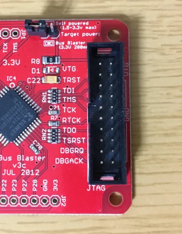
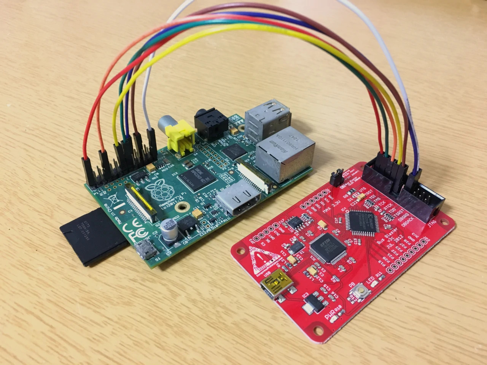

JTAG デバッガが欲しくなったので [Bus Blaster v3](http://dangerousprototypes.com/docs/Bus_Blaster) を買いました。

<blockquote class="twitter-tweet tw-align-center"><p lang="ja" dir="ltr">Bus Blaster v3 きた (JTAG したくなったので) <a href="https://t.co/fQRNPmFthV">pic.twitter.com/fQRNPmFthV</a></p>&mdash; ✧*。ヾ(｡ᐳ﹏ᐸ｡)ﾉﾞ。*✧ (@myon___) <a href="https://twitter.com/myon___/status/1277843634268721152?ref_src=twsrc%5Etfw">June 30, 2020</a></blockquote> <script async src="https://platform.twitter.com/widgets.js" charset="utf-8"></script>

よくある [FT2232H](https://www.ftdichip.com/Products/ICs/FT2232H.htm) が載っているやつですが、[出力側に CPLD をいれる](http://dangerousprototypes.com/docs/Bus_Blaster_v3_design_overview#Buffered_interface)ことで、ターゲットの駆動電圧 (1.5v ~ 3.3v) に合わせたレベル変換やロジック書き換えによる別規格への対応などを実現した、なるほど〜ってなる設計に惹かれました。公式で紹介されている [Seeed Studio の販売ページ](https://www.seeedstudio.com/Bus-Blaster-v3.html) では売り切れだったので、[マルツオンライン](https://www.marutsu.co.jp/pc/i/27355200/)を使いました。

<!--more-->

## Raspberry Pi Model B で使ってみる

ということで早速使ってみます。ターゲットには、手持ちのデバイスで一番遊びやすそうだった Raspberry Pi Model B を選びました。最近の Raspberry Pi はかなり性能・機能が強くなっているようですが、これは初代の Raspberry Pi です。2020年の記事ですが初代です。

### Raspberry Pi と Bus Blaster を接続する

Raspberry Pi Model B に載っている SoC の BCM2835 は、GPIO を入力・出力のほか 6つの Alternate mode が指定でき、そのときの特別な役割が各ピンごとに決められています。これをまとめた表が[ペリフェラルのマニュアル](https://www.raspberrypi.org/documentation/hardware/raspberrypi/bcm2835/BCM2835-ARM-Peripherals.pdf)の Table 6-31 にあります。

JTAG 用のピンも、ある GPIO の Alternate mode として実装されています。今回 JTAG に使う GPIO をまとめるとこんな感じになります。TDI は GPIO26 の Alt4 にもありますが、今回使う Raspberry Pi Model B だと基板上のピンヘッダと繋がっていないため、GPIO4 の Alt5 を使います。

| GPIO | P1 ヘッダのピン番号 | JTAG の役割 | モード | 
| --- | --- | --- | --- |
| - | 1 または 17 | VTref (VTG) | - |
| GPIO22 | 15 | TRST | Alt4 |
| GPIO4 | 7 | TDI | Alt5 |
| GPIO27 | 13 | TMS | Alt4 |
| GPIO25 | 22 | TCK | Alt4 |
| GPIO24 | 18 | TDO | Alt4 |
| - | 6, 9, 14, 20, 25 のどれか | GND | - |

Raspberry Pi の P1 ヘッダの役割は[このページの図](https://elinux.org/RPi_Low-level_peripherals#P1_Header)などがわかりやすいです。これらを参考にしながら Bus Blaster と接続していきます。Bus Blaster は基板上にピンの役割が書いてあるのがいいですね。





Bus Blaster の JP4 に刺さっているジャンパピンは、今回は外したほうが良さそうです。JP4 は Bus Blaster からターゲットに給電する・しないを切り替えるものです。Raspberry Pi は電源供給用の USB Micro-B 端子があるので Bus Blaster からの給電は必要ないですし、Bus Blaster から供給できるのは 3.3v 200mA が最大で Raspberry Pi を動かすには弱いためです。

### `config.txt` から JTAG デバッグを有効にする (失敗)

Raspberry Pi は、CPU が動き始める前に GPU が様々な初期化を行なう不思議な仕様をしているそうです。そのときに読み込まれる設定ファイルが SD カードに置いた [`config.txt`](https://www.raspberrypi.org/documentation/configuration/config-txt/) です。`config.txt` には [GPIO に関する項目](https://www.raspberrypi.org/documentation/configuration/config-txt/gpio.md) もあり、`enable_jtag_gpio=1` と記述すれば JTAG デバッグに必要な GPIO の設定をやってくれるそうです。

しかしリンク先をよく見ると

> ##### `enable_jtag_gpio`
> Setting `enable_jtag_gpio=1` **selects Alt4 mode for GPIO pins 22-27**, and sets up some internal SoC connections, thus enabling the JTAG interface for the ARM CPU. It works on all models of Raspberry Pi.

と書いてあり、今回のように TDI に GPIO 4 を使うことは想定されていなさそうです[^rpicfg]。

実際にこのオプションを設定した Raspberry Pi で [U-Boot](https://github.com/u-boot/u-boot) を起動し、`md` コマンドで GPIO の機能を指定する GPFSELn レジスタ付近 (`0x20200000`) を覗いてみた結果がこれです。GPFSEL2 (`0x20200008`) の値は `0x006db6c8` (`0b011011011011011011001000`) で、確かに GPIO 22-27 に対応したビット `[23:6]` が全て Alt4 (`0b011`) になっています。しかし GPFSEL0 (`0x20200000`) の値は `0x24864024` (`0b100100100001100100000000100100`) で、GPIO 4 に対応したビット `[14:12]` は Alt1 (`0b100`) になっています。残念。

    
    
    U-Boot 2020.07-rc5-00052-g922c6d5d00 (Jun 25 2020 - 23:58:27 +0900)
    
    DRAM:  448 MiB
    RPI Model B rev2 (0xd)
    MMC:   mmc@7e202000: 0
    In:    serial
    Out:   vidconsole
    Err:   vidconsole
    Net:   No ethernet found.
    starting USB...
    Bus usb@7e980000: USB DWC2
    scanning bus usb@7e980000 for devices... 3 USB Device(s) found
           scanning usb for storage devices... 0 Storage Device(s) found
    Hit any key to stop autoboot:  0 
    U-Boot> md 20200000 10  
    20200000: 24864024 00064024 006db6c8 00000000    $@.$$@....m.....
    20200010: 24020004 00000924 00000000 6770696f    ...$$.......oipg
    20200020: 6770696f 6770696f 6770696f 6770696f    oipgoipgoipgoipg
    20200030: 6770696f 0101c1cf 003e001c 00000000    oipg......>.....

[^rpicfg]: "It works on all models of Raspberry Pi." とは... これ [raspberrypi/firmware](https://github.com/raspberrypi/firmware) とかに報告したら解決したりするかなぁ

`config.txt` では、各 GPIO のモードやプルアップ・プルダウンの設定を細かく指定できるようです。そこで
```
gpio=4=pu,a5
gpio=22,24,25,27=pu,a4
```
と書いてみましたが、これもダメでした。先ほどと同様に U-Boot でレジスタの値を見てみると、GPFSEL2 は `0x0061b0c8` (`0b011000011011000011001000`) で意図したとおりの値になっています。しかし GPFSEL0 は `0x24864024` で GPIO 4 は Alt1 のままです。GPIO 4 のモードは `config.txt` から設定できない (なにか理由があって Alt1 にされている？) みたいです。これまた残念。

    U-Boot> md 20200000 10
    20200000: 24864024 00064024 0061b0c8 00000000    $@.$$@....a.....
    20200010: 24020004 00000924 00000000 6770696f    ...$$.......oipg
    20200020: 6770696f 6770696f 6770696f 6770696f    oipgoipgoipgoipg
    20200030: 6770696f 0a41c1cf 003e001c 00000000    oipg..A...>.....

### JTAG デバッグ有効化のコードを書く

`config.txt` を使った方法がダメだったので、自分で GPIO を設定していきます。GPIO の設定は、上でも軽く触れた BCM2835 の GPIO 周りのレジスタを[ペリフェラルのマニュアル](https://www.raspberrypi.org/documentation/hardware/raspberrypi/bcm2835/BCM2835-ARM-Peripherals.pdf) などを参考にしながら操作していけばよいです。

まずは GPIO 4 のモードを Alt5 にします。GPIO 0 ~ 9 のモードは GPFSEL0 レジスタ (`0x20200000`) で指定します。GPIO 4 に対応するビットは `[14:12]` で、ここを Alt5 を意味する `0b010` に変更すればよいです。C で書くとこんな感じになります。`~(0x7 << (4 * 3))` との AND をとって `[14:12]` のビットをクリアし、そのあと `0x2 << (4 * 3)` との OR をとって `0b010` に書き換える、というコードです。

```c
volatile uint32_t* GPFSEL0 = (volatile uint32_t*)0x20200000;

uint32_t sel0 = *GPFSEL0;
sel0 &= ~(0x7 << (4 * 3)); // GPIO4: ALT5
sel0 |= 0x2 << (4 * 3);
*GPFSEL0 = sel0;
```

同じように GPIO 22, 24, 25, 27 のモードを Alt4 にします。GPIO 20 ~ 29 のモードは GPFSEL2 レジスタ (`0x20200008`) で指定します。各 GPIO に対応するビットを、今度は Alt4 を意味する `0b011` に変更していきます。

```c
volatile uint32_t* GPFSEL2 = (volatile uint32_t*)0x20200008;

uint32_t sel2 = *GPFSEL2;
sel2 &= ~(0x7 << (2 * 3)); // GPIO22: ALT4
sel2 |= 0x3 << (2 * 3);
sel2 &= ~(0x7 << (4 * 3)); // GPIO24: ALT4
sel2 |= 0x3 << (4 * 3);
sel2 &= ~(0x7 << (5 * 3)); // GPIO25: ALT4
sel2 |= 0x3 << (5 * 3);
sel2 &= ~(0x7 << (7 * 3)); // GPIO27: ALT4
sel2 |= 0x3 << (7 * 3);
*GPFSEL2 = sel2;
```

Raspberry Pi は GPIO のプルアップ・プルダウンをプログラマブルに変更できるようです。これを使って、GPIO 4, 22, 24, 25, 27 のプルアップを有効にします。この操作は接続するデバッガによっては不要かもしれませんが、今回は Bus Blaster と接続したピンを全てプルアップしないとうまく動いてくれませんでした。

プルアップ・プルダウンの指定は次の流れで行います。

1. GPPUD レジスタ (`0x20200094`) の下位2ビットに値をセット (プルアップなら `0b10`)
2. 150 サイクルくらい待つ
3. 対象の GPIO に対応した GPPUDCLK0 (`0x20200098`), GPPUDCLK1 (`0x2020009c`) レジスタのビットを立てる
4. 150 サイクルくらい待つ
5. GPPUD, GPPUDCLK0, GPPUDCLK1 をクリア

そして、これに対応するコードはこんな感じになります。

```c
volatile uint32_t* GPPUD = (volatile uint32_t*)0x20200094;
volatile uint32_t* GPPUDCLK0 = (volatile uint32_t*)0x20200098;

*GPPUD = 2;                 // (1)
asm("   mov r0, #0x96\n"    // (2)
    "1: subs r0, r0, #1\n"
    "   bne 1b"
    : : : "r0", "cc");
*GPPUDCLK0 = (1 << 4) | (1 << 22) | (1 << 24) | (1 << 25) | (1 << 27);  // (3)
asm("   mov r0, #0x96\n"    // (4)
    "1: subs r0, r0, #1\n"
    "   bne 1b"
    : : : "r0", "cc");
*GPPUD = 0;                 // (5)
*GPPUDCLK0 = 0;
```

このコードをデバッグしたいベアメタルなアプリケーションに組み込めば、それが実行された時点からデバッグできるようになります。JTAG 有効化だけを行なうものを SD カードに入れておいて、アプリケーションは常に JTAG 経由でを流し込む、といった使い方もアリだと思います。自分は試していないですが、U-Boot にこれらのコードを組み込むなどすれば、実装したベアメタルアプリケーションはもちろん、Linux カーネルなんかも起動時からデバッグできたりするかもしれません。

### OpenOCD と GDB でデバッグしてみる

ハード側の準備ができたので今度はソフトの準備です。今回は OpenOCD と GDB を使ってみます。GDB はおなじみのデバッグツールで、OpenOCD は接続した JTAG デバッガと GDB の橋渡しをしてくれるものです。どちらも Arch Linux 上で `pacman` からインストールしたものを使いました。バージョンはこんな感じです。

    $ sudo pacman -S openocd arm-none-eabi-gdb
    
    $ openocd -v    
    Open On-Chip Debugger 0.10.0
    Licensed under GNU GPL v2
    For bug reports, read
    	http://openocd.org/doc/doxygen/bugs.html
    
    $ arm-none-eabi-gdb --version
    GNU gdb (GDB) 9.2
    Copyright (C) 2020 Free Software Foundation, Inc.
    License GPLv3+: GNU GPL version 3 or later <http://gnu.org/licenses/gpl.html>
    This is free software: you are free to change and redistribute it.
    There is NO WARRANTY, to the extent permitted by law.

OpenOCD は、[User's Guide](http://openocd.org/doc/html/Running.html#Simple-setup_002c-no-customization) にあるように、JTAG デバッガとターゲットに関する2つの設定ファイル ([Jim-Tcl](http://openocd.org/doc/html/About-Jim_002dTcl.html#About-Jim_002dTcl) スクリプト) を `-f` オプションで渡してやるだけで起動します。Bus Blaster の設定ファイルは OpenOCD に含まれていて `interface/ftdi/dp_busblaster.cfg` を指定すれば良さそうです。一方 Raspberry Pi の設定ファイルは含まれていないため、別途用意が必要です。今回は[BareMetalで遊ぶ　Raspberry Pi](https://tatsu-zine.com/books/raspi-bm) でも紹介されていた [`raspi.cfg`](https://github.com/dwelch67/raspberrypi/blob/master/armjtag/raspi.cfg) に、[`arm11 memwrite burst disable`](http://openocd.org/doc/html/Architecture-and-Core-Commands.html#ARM11-specific-commands) を追記したものを使いました。自分の環境ではこれを追記しないと、GDB での各操作が不安定だったり、libc などをリンクした少し大きめのバイナリを `load` させると失敗するなどの症状がありました。

```tcl
# Broadcom 2835 on Raspberry Pi

telnet_port 4444
#gdb_port 0
#tcl_port 0

#jtag_khz 1000
adapter_khz 1000

#jtag_nsrst_delay 400
#jtag_ntrst_delay 400

if { [info exists CHIPNAME] } {
   set  _CHIPNAME $CHIPNAME
} else {
   set  _CHIPNAME raspi
}

reset_config none

if { [info exists CPU_TAPID ] } {
   set _CPU_TAPID $CPU_TAPID
} else {
   set _CPU_TAPID 0x07b7617F
}
jtag newtap $_CHIPNAME arm -irlen 5 -expected-id $_CPU_TAPID

set _TARGETNAME $_CHIPNAME.arm
target create $_TARGETNAME arm11 -chain-position $_TARGETNAME

arm11 memwrite burst disable
```

`interface/ftdi/dp_busblaster.cfg` および修正した `raspi.cfg` を OpenOCD 起動時に渡してやり、こんな感じのメッセージが出たら成功です。

    $ openocd -f interface/ftdi/dp_busblaster.cfg -f raspi.cfg
    Open On-Chip Debugger 0.10.0
    Licensed under GNU GPL v2
    For bug reports, read
    	http://openocd.org/doc/doxygen/bugs.html
    Info : If you need SWD support, flash KT-Link buffer from https://github.com/bharrisau/busblaster
    and use dp_busblaster_kt-link.cfg instead
    adapter speed: 1000 kHz
    none separate
    Info : auto-selecting first available session transport "jtag". To override use 'transport select <transport>'.
    Info : memory write burst mode is disabled
    Info : clock speed 1000 kHz
    Info : JTAG tap: raspi.arm tap/device found: 0x07b7617f (mfg: 0x0bf (Broadcom), part: 0x7b76, ver: 0x0)
    Info : found ARM1176
    Info : raspi.arm: hardware has 6 breakpoints, 2 watchpoints

OpenOCD が起動すると、GDB server が 3333 ポートで 立ち上がります。これに GDB から `target remote localhost:3333` で接続すればデバッグの準備は完了です。下の実行例で渡している `-q` オプションは GDB 起動時に表示されるバージョン等を非表示にするもので、`blink.elf` が今回デバッグしようとしているプログラムです。

    $ arm-none-eabi-gdb -q blink.elf
    Reading symbols from blink.elf...
    (gdb) target remote localhost:3333
    Remote debugging using localhost:3333
    main () at main.cc:21
    21	  for (;;)
    (gdb)

たまに `target ...` で接続したあとプログラムカウンタが正しく表示されないことがあります。そのときは一旦 `continue` (またはその省略形 `c`) で実行を再開させたあと Ctrl-C で中断すればなおるようです。

    (gdb) target remote localhost:3333
    Remote debugging using localhost:3333
    0x00000000 in ?? ()
    (gdb) c
    Continuing.
    WARNING! The target is already running. All changes GDB did to registers will be discarded! Waiting for target to halt.
    ^C
    Program received signal SIGINT, Interrupt.
    main () at main.cc:21
    21	  for (;;)
    (gdb)

あとはだいたいいつも通りの GDB の操作ができるほか、`load` コマンドでプログラムを再転送できたりします。

    (gdb) load
    Loading section .text, size 0x69228 lma 0x8000
    Loading section .rodata, size 0x763c lma 0x71228
    Loading section .ARM.extab, size 0x4b70 lma 0x78864
    Loading section .ARM.exidx, size 0x3500 lma 0x7d3d4
    Loading section .init_array, size 0x1c lma 0x808d4
    Loading section .fini_array, size 0x4 lma 0x808f0
    Loading section .data, size 0xab0 lma 0x808f8
    Start address 0x00008000, load size 496548
    Transfer rate: 30 KB/sec, 14187 bytes/write.
    (gdb) 


## おわり

JTAG デバッガ Bus Blaster v3 を使って Raspberry Pi Model B をデバッグしてみる例を紹介しました。マイコンの解析やデバッグがとても便利になるツールが比較的安価で手に入るのはよいですね。

今回 JTAG デバッガが欲しくなったのは、JTAG を使ったデバッグはあまりやったことがなく試してみたくなった[^jtag]のと、いろいろあって Raspberry Pi のベアメタルアプリケーションを書いていてどうしてもわからなかったバグ[^bug][^ochi]を調べたかったのが理由です。せっかく興味を持って取り組んでいたジャンルなので、これをきっかけにもっと突き詰めてみたいですし、いずれは謎デバイスの解析とかもやってみたいなと思います。

[^jtag]: FPGA を触っていたときビットストリームやプログラムの転送にはよく使っていたけど、デバッグはあまりやらなかった
[^bug]: `float` や `double` の値を `printf` などで表示しようとするとその値がおかしいというもの。[これ](https://sourceware.org/legacy-ml/crossgcc/2010-10/msg00147.html) とおそらく同じもので、スタックポインタの初期値が悪く ARM EABI の[関数呼び出し時のスタックポインタが 8 byte でアラインされていること](https://wiki.debian.org/ArmEabiPort#Stack_alignment)というルールが守れていなかったのが原因だった
[^ochi]: ちなみにこのバグは Bus Blaster を発注したあとすぐに原因がわかってしまったというオチがあります

## 関連リンク

- [BareMetalで遊ぶ　Raspberry Pi - 達人出版会](https://tatsu-zine.com/books/raspi-bm)
- [BCM2835 - Raspberry Pi Documentation](https://www.raspberrypi.org/documentation/hardware/raspberrypi/bcm2835/README.md)
    - [BCM2835 ARM Peripherals](https://www.raspberrypi.org/documentation/hardware/raspberrypi/bcm2835/BCM2835-ARM-Peripherals.pdf)
- [RPi Low-level peripherals - eLinux.org](https://elinux.org/RPi_Low-level_peripherals)
- [OpenOCD User’s Guide: Top](http://openocd.org/doc/html/index.html)
