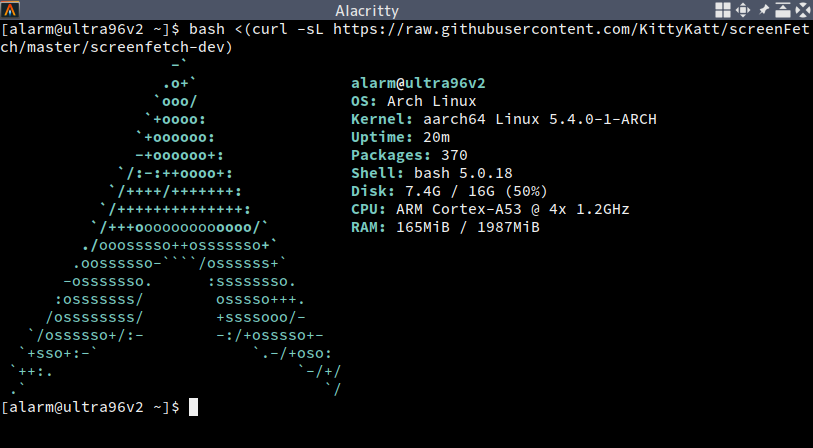
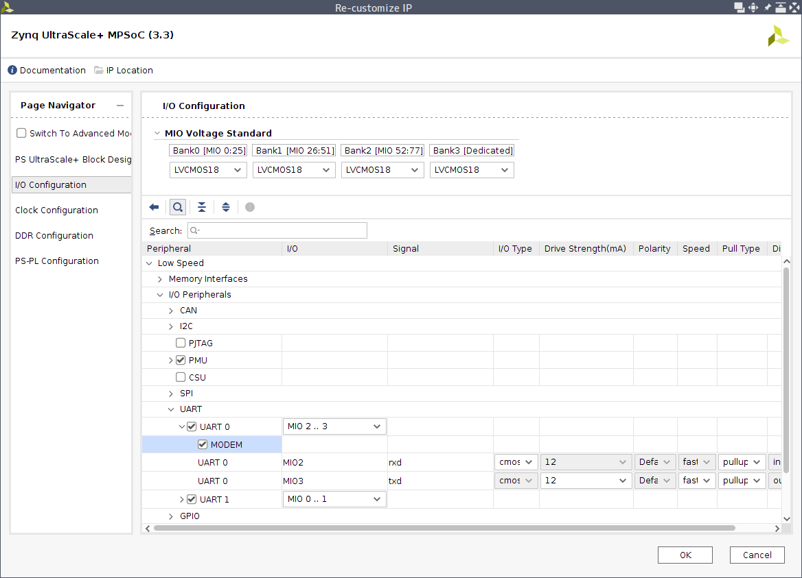
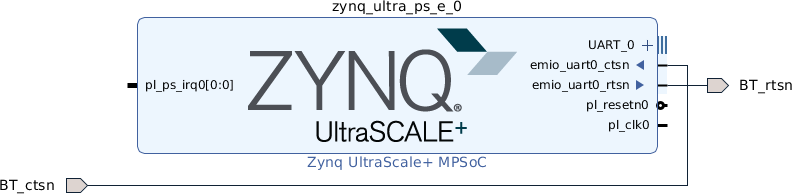

[Zynq UltraScale+ MPSoC](https://www.xilinx.com/products/silicon-devices/soc/zynq-ultrascale-mpsoc.html) をはじめとする Xilinx の各種プラットフォーム上で、決められた用途の Linux ベースなシステムを構築するなら公式で提供されている [PetaLinux Tools](https://www.xilinx.com/products/design-tools/embedded-software/petalinux-sdk.html) が便利です。以前取り上げた [Ultra96 のアレ](/blog/2019/05/15/ultra96-julia-set-explorer/)でも使っています。一方で、動かした Linux 環境の上で雑な作業したいなどの用途では、構築後の拡張がしにくい PetaLinux Tools は微妙です。例えば Raspberry Pi 向けに提供される [Raspberry Pi OS](https://www.raspberrypi.org/software/) のような汎用の Linux ディストリビューションベースの環境が欲しくなります。

Ultra96 向けに提供される汎用の Linux ディストリビューションベースな環境として、例えば [PYNQ](http://www.pynq.io/) が Ubuntu ベースらしかったり、[ikwzm さんの Debian 10 イメージ](https://github.com/ikwzm/ZynqMP-FPGA-Linux) などが見つかります。ただ、自分としては普段使って慣れている [Arch Linux](https://www.archlinux.org/) 環境があるともっと嬉しいな... ということで、[Arch Linux ARM](https://archlinuxarm.org/) を動かしてみました。



この記事では、前半でインストール方法の一例を、後半で関連するファイル類などをあげた GitHub リポジトリ [Tosainu/zynqmp-arch][zynqmp-arch] について紹介していきます。

<!--more-->

## インストール方法

### 準備

作業にあたって必要なツールなどは次の通りです。

- Linux 環境 (Arch Linux, Ubuntu, CentOS など)
- [Vitis 2020.1](https://www.xilinx.com/products/design-tools/vitis.html)[^2020-2]
- ライブラリを静的リンクした QEMU の User space emulator
- [arch-install-scripts](https://github.com/archlinux/arch-install-scripts)

[^2020-2]: つい最近 [v2020.2](https://www.xilinx.com/support/download/index.html/content/xilinx/en/downloadNav/vivado-design-tools/2020-2.html) が出たっぽいですね。自分はまだ確認できていませんが、"- Petalinux now a part of Xilinx Unified Installer" が気になります。あの微妙なインストーラが改善されてたりするのかな...

今回紹介するインストール方法には、Linux 環境がインストールされた PC が必要です。特に後半の作業は Arch Linux があると楽ですが、Vitis がサポートする Ubuntu や CentOS でも大丈夫だと思います。ちなみに自分は Arch Linux を使い、Vitis は [systemd-nspawn](https://wiki.archlinux.org/index.php/Systemd-nspawn) を使って構築した Ubuntu 環境内で動かしています[^nspawn]。

[Xilinx Software Command-Line Tool](https://www.xilinx.com/html_docs/xilinx2020_1/vitis_doc/upu1569395223804.html) (xsct) や同梱される aarch64 と microblaze 向けクロスコンパイラなども利用するため Vitis が必要です。Vivado だけではだめです

[^nspawn]: Vitis はインストールサイズが 100GB 程度もあって[以前紹介した](/blog/2018/09/15/install-xilinx-tools-into-docker-container/) Docker 環境だと扱いづらくなる

インストールの後半、SD カードに展開した Arch Linux ARM システム初期設定のため chroot する作業があります。もちろんターゲットが ARM なので、直接 chroot はできません。今回は QEMU の力を借ります。QEMU は、[binfmt_misc](https://www.kernel.org/doc/html/latest/admin-guide/binfmt-misc.html) と組み合わせて aarch64 向けの ELF をあたかも作業マシン上で直に実行できるかのようにしておきます。Arch Linux であれば AUR の [binfmt-qemu-static][binfmt-qemu-static] と [qemu-user-static][qemu-user-static] パッケージが利用できます ([ArchWiki][qemu-wiki])。Docker イメージの [multiarch/qemu-user-static][multiarch-qemu-static] を使うのも簡単です。

Arch Linux 環境に chroot する際には arch-install-scripts の [`arch-chroot`][arch-chroot-man] が便利です。Arch Linux では `pacman` からインストールできます。それ以外のディストリビューションでも、(使えるかは未確認ですが) こんな感じにインストールできます。もちろん `arch-chroot` を使わない方法もありますが、ここでは取り扱いません。

    $ git clone https://github.com/archlinux/arch-install-scripts
    $ cd arch-install-scripts
    $ make
    $ make install PREFIX=~/.local

### FPGA デザインの作成

まずは Vivado で FPGA のデザインを作成します。とりあえず動かすものなら、IP Integrator で Zynq UltraScale+ MPSoC ブロックを配置するだけでよいと思います。

Ultra96 に載ってる Bluetooth を使いたい場合には少し設定が必要です。[Avnet/Ultra96-PYNQ](https://github.com/Avnet/Ultra96-PYNQ) リポジトリなどの情報によれば、まず PS の設定から UART 0 の MODEM にチェックを入れて



そのあと PS のブロックから生えた `emio_uart0_ctsn`, `emio_uart0_rtsn` を適当な名前のポートで外に出します。



あとはこんな感じの `.xdc` ファイルを追加して外に出したポートにピンを割り当てればよいそうです。

```tcl
set_property -dict { PACKAGE_PIN B7   IOSTANDARD LVCMOS18 } [get_ports { BT_ctsn }]; 
set_property -dict { PACKAGE_PIN B5   IOSTANDARD LVCMOS18 } [get_ports { BT_rtsn }];
```

作成したデザインの Bitstream 生成まで済ませたら `.xsa` ファイルを出力します。TCL Console から次のコマンドを実行するのが簡単です。

```tcl
write_hw_platform -fixed -include_bit system.xsa
```

### SD カードへのインストール

時間のかかる Arch Linux ARM の tarball のダウンロードから始めるのがおすすめです。Arch Linux ARM は、特定のプラットフォーム向けのもののほか汎用の (Generic) tarball が提供されており、今回はその aarch64 版を使います。[ここ](https://archlinuxarm.org/platforms/armv8/generic) から `ArchLinuxARM-aarch64-latest.tar.gz` をダウンロードしておきます。

SD カードには少なくとも2つのパーティションを作ります。1つが後ほど作成する `BOOT.BIN` やカーネルを置くもの、残りが Arch Linux ARM の rootfs を展開するものです。

パーティションテーブルの操作には `fdisk` を使うことにします。第1引数に接続した SD カードに対応するデバイス (ここでは `/dev/sdX`) を渡して起動し

    $ sudo fdisk /dev/sdX

まずは `o` コマンドで新しく空のパーティションテーブルを作成します。

    Command (m for help): o
    Created a new DOS disklabel with disk identifier 0xad9770e8.

`n` コマンドで1つ目のパーティションを作成します。サイズは 100 ~ 200 MB 程度あれば十分だと思います。作成したパーティションは、`t` コマンドでタイプを W95 FAT16 (LBA) `0x0e` または W95 FAT32 (LBA) `0x0c` に変更しておきます。

    Command (m for help): n
    Partition type
    p   primary (0 primary, 0 extended, 4 free)
    e   extended (container for logical partitions)
    Select (default p): p
    Partition number (1-4, default 1): 1
    First sector (2048-124975103, default 2048):
    Last sector, +/-sectors or +/-size{K,M,G,T,P} (2048-124975103, default 124975103): +200M
    
    Created a new partition 1 of type 'Linux' and of size 200 MiB.
    
    Command (m for help): t
    Selected partition 1
    Hex code or alias (type L to list all): e
    Changed type of partition 'Linux' to 'W95 FAT16 (LBA)'.

再度 `n` コマンドを使い、rootfs 用のパーティションを作っていきます。今回は残った領域全体を1つのパーティションにしました。

    Command (m for help): n
    Partition type
    p   primary (1 primary, 0 extended, 3 free)
    e   extended (container for logical partitions)
    Select (default p): p
    Partition number (2-4, default 2):
    First sector (411648-124975103, default 411648):
    Last sector, +/-sectors or +/-size{K,M,G,T,P} (411648-124975103, default 124975103):
    
    Created a new partition 2 of type 'Linux' and of size 59.4 GiB.

最後に `w` コマンドでパーティションテーブルを反映させれば完了です。

    Command (m for help): w
    The partition table has been altered.
    Calling ioctl() to re-read partition table.
    Syncing disks.

パーティションを作り終わったら、1つ目のパーティションを FAT16 (または FAT32) [^fat1]で、残りを適当なファイルシステム[^f2fs] (下の例は EXT4) でフォーマットします。

    $ sudo mkfs.vfat /dev/sdX1
    $ sudo mkfs.ext4 /dev/sdX2

[^fat1]: [Technical Reference Manual (ug1085)](https://www.xilinx.com/support/documentation/user_guides/ug1085-zynq-ultrascale-trm.pdf) の "Chapter 11: Boot and Configuration" によると FAT16 / FAT32 ともに対応しているらしい。いろいろ試した感じ、電源投入後に基板上の DONE_LED (D1) 点灯までの時間が FAT16 のほうが速い気がするので FAT16 で運用してみてる

[^f2fs]: 自分は F2FS を試しています

フォーマットしたパーティションは、適当なディレクトリ (`/mnt` など) にマウントし、そこにダウンロードした `ArchLinuxARM-aarch64-latest.tar.gz` を展開します。

    $ sudo mount /dev/sdX2 /mnt
    $ sudo mkdir -p /mnt/boot
    $ sudo mount /dev/sdX1 /mnt/boot
    
    $ sudo bsdtar -xpf ArchLinuxARM-aarch64-latest.tar.gz -C /mnt
    $ sync

### 展開した Arch Linux ARM 環境の初期設定

SD カードに展開した Arch Linux ARM 環境は、そのままでは Ultra96 で動かすのに微妙です。例えば WiFi 関連パッケージが入っていないので、そのまま起動させても必要なパッケージを追加したりするのが難しかったりします。展開した環境に chroot し、パッケージの削除・更新・追加などをして実機で起動させたあと困らない状態にしておきます。

前述したとおり、chroot には `arch-chroot` コマンドを使います。`/dev` や `/sys` のマウント・アンマウントや、`/etc/resolv.conf` への symlink を張ってくれる便利なヤツです。

    $ sudo arch-chroot /mnt /bin/bash

chroot したら、特に意味はないですが `lscpu` みたいなコマンドを実行してみるのがおすすめです。不思議な気持ちになれます。

    # lscpu
    Architecture:                    aarch64
    CPU op-mode(s):                  32-bit, 64-bit
    Byte Order:                      Little Endian
    Address sizes:                   48 bits physical, 48 bits virtual
    CPU(s):                          12
    On-line CPU(s) list:             0-11
    Thread(s) per core:              2
    Core(s) per socket:              6
    Socket(s):                       1
    NUMA node(s):                    1
    Vendor ID:                       AuthenticAMD
    CPU family:                      23
    Model:                           96
    Model name:                      AMD Ryzen 5 PRO 4650U with Radeon Graphics
    (...)

Arch Linnux ARM 公式の手順通りに、まずは pacman keyring を初期化します。

    # packan-key --init
    # packan-key --populate archlinuxarm

続いて `/etc/pacman.conf` を編集しパッケージリポジトリを追加します。ここで指定している `zynqmp-arch.myon.info` は、前述した GitHub リポジトリの GitHub Pages を使ってホストしているもので、Zynq UltraScale+ MPSoC 向けのカーネルや Ultra96-V2 の WiFi ドライバなどのパッケージを配布しています。このあたりの詳細については後ほど紹介します。

    # cat >> /etc/pacman.conf <<EOS
    
    [zynqmp-arch]
    SigLevel = Never
    Server = https://zynqmp-arch.myon.info/\$arch
    EOS

Arch Linux ARM の tarball は、この記事執筆時点での最終更新日が 2020/08/09 とちょっと古めなのでパッケージを更新しておきたいところです。ただその前にまず、今後使わなさそうなパッケージをアンインストールしておきます。特にカーネル (`linux-aarch64`) は、更新時の initramfs の再生成が結構時間がかかってつらいので消しておくとよいです。`pacman` に渡すオプションは、`dhcpcd` などはそれらが依存するパッケージも消すために `-Rncs` で、`linux-aarch64` はパッケージ単体を消すために `-Rnd` とするとよさそうです。

    # pacman -Rncs dhcpcd net-tools netctl
    # pacman -Rnd linux-aarch64

そうしたら、システムのパッケージを更新したり

    # pacman -Syu

WiFi 接続に使う `iwd` や、`zynqmp-arch` リポジトリのカーネルや WiFi ドライバなど必要なパッケージをインストールします。

    # pacman -S iwd
    # pacman -S linux-zynqmp
    # pacman -S wilc3000-ultra96v2 wilc-firmware

いろいろパッケージのインストールが済んだら、必要なくなったパッケージのアンインストールもしておくとよいでしょう。

    # pacman -Rncs $(pacman -Qdtq)

ユーザアカウントや `/etc/fstab` の設定[^fstab]をして完了です。`exit` で chroot 環境を抜けます。

    # passwd
    # passwd alarm

    # cat >> /etc/fstab <<EOS
    /dev/mmcblk0p2 /     ext4 defaults 0 1
    /dev/mmcblk0p1 /boot vfat defaults 0 2
    EOS

    # exit

[^fstab]: Ultra96 にさした micro SD カードは特別なことをしなければ `/dev/mmcblk0` になると思うのでこれで指定しています。たくさん SATA や NVMe などのストレージを載せるマシンだと、ポートを繋ぎ変えたときなどでも目的のパーティションを確実にマウントさせるため UUID やラベルを使ったりします

### ブートローダ・ファームウェアのビルド

最後に、First Stage Boot Loader (FSBL) や U-Boot といったブートローダと、ARM Trusted Firmware や PMU のファームウェアの準備、およびそれらをまとめたブートイメージ `BOOT.BIN` を作ります。これらの手順は、[Xilinx Wiki のこのあたり](https://xilinx-wiki.atlassian.net/wiki/spaces/A/pages/460653138/Xilinx+Open+Source+Linux) にまとまっているので、あわせて確認するとよいでしょう。

FSBL と PMU Firmware のソースコードは、Xilinx Software Command-Line Tool を使って出力できます。まず、Vivado で出力した `.xsa` ファイルを、新たに作成したディレクトリにコピーしておきます。これは、このあと `xsct` で呼び出す [`hsi::open_hw_design`](https://www.xilinx.com/html_docs/xilinx2020_1/vitis_doc/dxk1575554094185.html) コマンドが、`.xsa` ファイルあるディレクトリにその中身[^xsa]を展開してくるためです。

    $ mkdir xsct && cd $_
    $ cp /path/to/system.xsa .

[^xsa]: `.xsa` ファイルは Zip 形式で圧縮されたファイルっぽい

`xsct` コマンドを実行し、そのインタプリタで次のコマンドを実行します。単にソースコードを出力させるだけならもっと簡単にできるのですが、メッセージの出力を UART 1 に変更するためこうなっています。これらコマンドを実行すると、最初に作成したディレクトリの `fsbl`, `pmufw` にそれぞれのソースコードが出力されます。

    $ xsct

    xsct% set hw_design [hsi open_hw_design system.xsa]

    xsct% set sw_design [hsi create_sw_design fsbl -proc psu_cortexa53_0 -os standalone]
    xsct% hsi set_property CONFIG.stdin  psu_uart_1 [hsi get_os]
    xsct% hsi set_property CONFIG.stdout psu_uart_1 [hsi get_os]
    xsct% hsi add_library xilffs
    xsct% hsi add_library xilpm
    xsct% hsi add_library xilsecure
    xsct% hsi generate_app -hw $hw_design -sw $sw_design -app zynqmp_fsbl -dir fsbl
    xsct% hsi close_sw_design $sw_design

    xsct% set sw_design [hsi create_sw_design pmufw -proc psu_pmu_0 -os standalone]
    xsct% hsi set_property CONFIG.stdin  psu_uart_1 [hsi get_os]
    xsct% hsi set_property CONFIG.stdout psu_uart_1 [hsi get_os]
    xsct% hsi add_library xilfpga
    xsct% hsi add_library xilsecure
    xsct% hsi add_library xilskey
    xsct% hsi generate_app -hw $hw_design -sw $sw_design -app zynqmp_pmufw -dir pmufw
    xsct% hsi close_sw_design $sw_design

    xsct% exit

実行するコマンドは TCL のスクリプトにしておき、それを `xsct` コマンドに渡してもいいかもしれません。

    $ xsct script.tcl

Ultra96 では、PMU Firmware のデフォルトで無効になっているいくつかのオプションを指定してやると便利です。基板上の電源ボタンでシャットダウンが効くように、`Makefile` の `CFLAGS` に `-DENABLE_MOD_ULTRA96` および `-DULTRA96_VERSION=<Ultra96 のバージョン>` を追記します。

    $ sed -i 's/^\(CFLAGS :=.*$\)/\1 -DENABLE_MOD_ULTRA96 -DULTRA96_VERSION=2/' pmufw/Makefile

また、電源ボタンやコマンドなどからのシャットダウンで完全に電源を落とすために、`pmufw/xpfw_config.h` を編集し `PMU_MIO_INPUT_PIN_VAL`, `BOARD_SHUTDOWN_PIN_VAL`, `BOARD_SHUTDOWN_PIN_STATE_VAL` を `1` に変更します。

    $ sed -i 's/^\(#define\s\+PMU_MIO_INPUT_PIN_VAL\).*/\1 (1U)/;
              s/^\(#define\s\+BOARD_SHUTDOWN_PIN_VAL\).*/\1 (1U)/;
              s/^\(#define\s\+BOARD_SHUTDOWN_PIN_STATE_VAL\).*/\1 (1U)/' pmufw/xpfw_config.h

ソースコードの準備ができたらビルドします。ビルドに使われる aarch64 や microblaze のクロスコンパイラは、何もしなければ Vitis に入っているものが使われます。ビルドが終わると、それぞれのディレクトリに `executable.elf` が出力されます。ちなみにここで実行している `make` にビルドのジョブ数の指定オプション (`-jN`) を付けてはいけません。よくある依存関係が微妙な `Makefile` のようでビルドに失敗することがあります。

    $ make -C fsbl
    $ make -C pmufw

続いて Arm Trusted Firmware と U-Boot をビルドします。これらはソースコードを落としてきてビルドするだけなので簡単です。`make` 時にクロスコンパイラの実行ファイル名のプレフィックスを `CROSS_COMPILE` に指定すること、Arm Trusted Firmware の出力を UART 1 にするため `ZYNQMP_CONSOLE=cadence1` を付けること、U-Boot ビルド時に Arm Trusted Firmware ビルド時の生成物である `bl31.bin` のファイルパスが必要なことあたりがポイントです。U-Boot ビルド時 `DEVICE_TREE` に指定している `avnet-ultra96-rev1` は、厳密には初代 Ultra96 のものです。ただ U-Boot ではあまり関係ないのと、Linux ブート時に渡す Device Tree はまた別のものを指定できるので特に問題ないです。

    $ mkdir arm-trusted-firmware && cd $_
    $ curl -L https://github.com/Xilinx/arm-trusted-firmware/archive/xilinx-v2020.1.tar.gz | \
        tar xz --strip-components=1 -C .

    $ CROSS_COMPILE=aarch64-linux-gnu- ARCH=aarch64 \
        make -j12 PLAT=zynqmp RESET_TO_BL31=1 ZYNQMP_CONSOLE=cadence1

    $ cd ..

    $ mkdir u-boot-xlnx && cd $_
    $ curl -L https://github.com/Xilinx/u-boot-xlnx/archive/xilinx-v2020.1.tar.gz | \
        tar xz --strip-components=1 -C .

    $ CROSS_COMPILE=aarch64-linux-gnu- ARCH=aarch64 make xilinx_zynqmp_virt_defconfig
    $ CROSS_COMPILE=aarch64-linux-gnu- ARCH=aarch64 \
        DEVICE_TREE="avnet-ultra96-rev1" \
        BL31=$PWD/../arm-trusted-firmware/build/zynqmp/release/bl31.bin \
        make -j12 u-boot.elf

    $ cd ..

ここまででビルドしたもの、および Bitstream を適当なディレクトにコピーし、`bootgen` コマンドを使って `BOOT.BIN` ファイルを出力します。Bitstream には、`xsct` が展開したものを使うのが楽そうです。作成した `BOOT.BIN` は、SD カードの第1パーティションにコピーします。

    $ mkdir boot && cd $_
    $ cp ../xsct/fsbl/executable.elf fsbl.elf
    $ cp ../xsct/pmufw/executable.elf pmufw.elf
    $ cp ../xsct/<bitstream_name>.bit bitstream.bit
    $ cp ../arm-trusted-firmware/build/zynqmp/release/bl31/bl31.elf .
    $ cp ../u-boot-xlnx/u-boot.elf .

    $ cat > boot.bif <<EOS
    the_ROM_image:
    {
      [destination_cpu=a53-0, bootloader]                       fsbl.elf
      [destination_cpu=pmu]                                     pmufw.elf
      [destination_device=pl]                                   bitstream.bit
      [destination_cpu=a53-0, exception_level=el-3, trustzone]  bl31.elf
      [destination_cpu=a53-0, exception_level=el-2]             u-boot.elf
    }
    EOS

    $ bootgen -arch zynqmp -image boot.bif -w -o BOOT.BIN
    $ sudo cp BOOT.BIN /mnt/boot/

U-Boot は、ブートデバイスに `boot.scr` という名前で保存されたスクリプトを実行してくれるみたいです。これを利用してカーネルや initramfs、Device Tree を読み込ませることにします。まず `boot.cmd` などの適当な名前でファイルを作成し、こんな感じに記述します[^addr]。`bootargs` にはカーネルの起動オプションを、`fdtfile` には Device Tree Blob のファイル名を指定します[^fdtfile]。Device Tree Blob のファイルは、`linux-zynqmp` パッケージが第1パーティションにインストールしたものが使えます。Ultra96-V2 向けに編集したものも `avnet-ultra96-v2-rev1.dtb` という名前で追加してあります。

    setenv bootargs earlycon clk_ignore_unused root=/dev/mmcblk0p2 rw rootwait
    
    setenv fdtfile xilinx/avnet-ultra96-v2-rev1.dtb
    
    if load ${devtype} ${devnum}:${distro_bootpart} 0x00200000 /Image; then
      if load ${devtype} ${devnum}:${distro_bootpart} 0x00100000 /dtbs/${fdtfile}; then
        if load ${devtype} ${devnum}:${distro_bootpart} 0x04000000 /initramfs-linux-zynqmp.img; then
          booti 0x00200000 0x04000000:${filesize} 0x00100000;
        fi;
      fi;
    fi

[^addr]: カーネル、`.dtb`、initramfs のアドレスは PetaLinux Tools で Linux 環境を作ったとき出力された `boot.scr` を参考にしています

[^fdtfile]: [Xilinx/u-boot-xlnx](https://github.com/Xilinx/u-boot-xlnx) には、`.dtb` の `compatible` から `fdtfile` の初期値を決める[こんな処理](https://github.com/Xilinx/u-boot-xlnx/blob/xilinx-v2020.2/board/xilinx/zynqmp/zynqmp.c#L462-L497)が実装されています。この関数では `"xlnx,zynqmp-zcu104-revA"` といった文字列から `','` よりあとを取り出し `"xilinx/zynqmp-zcu104-revA.dtb"` という文字列を作って `fdtfile` に指定しているのですが、`compatible` に `"avnet,ultra96-rev1"`、実際のファイル名が `avnet-ultra96-rev1.dtb` となる Ultra96 では適切なパスになってくれません。面倒だったので `boot.scr` から指定し直していますが、公式に何かしら報告したほうがいい事案な気もしています

U-Boot をビルドしたディレクトリに `mkimage` というツールが入っているはずです。これを使って、作成したスクリプトから `boot.scr` を出力します。出力した `boot.scr` も SD カードの第1パーティションにコピーすれば準備完了です。

    $ /path/to/u-boot-xlnx/tools/mkimage -c none -A arm64 -T script -d boot.cmd boot.scr
    $ sudo cp boot.scr /mnt/boot/

### 起動!

SD カードをアンマウントしてから取り外し、Ultra96 に入れます。

    $ sudo umount /mnt{/boot,}

Ultra96 の電源を入れると、シリアルコンソールからまず FSBL, PMU Firmware, Arm Trusted Firmware, U-Boot とメッセージが表示されます。

    Xilinx Zynq MP First Stage Boot Loader
    Release 2020.1   Nov  7 2020  -  11:51:03
    PMU Firmware 2020.1	Nov  7 2020   11:51:27
    PMU_ROM Version: xpbr-v8.1.0-0
    NOTICE:  ATF running on XCZU3EG/silicon v4/RTL5.1 at 0xfffea000
    NOTICE:  BL31: v2.2(release):
    NOTICE:  BL31: Built : 11:51:33, Nov  7 2020
    
    
    U-Boot 2020.01 (Nov 07 2020 - 11:51:38 +0000)
    
    Model: Avnet Ultra96 Rev1
    Board: Xilinx ZynqMP
    DRAM:  2 GiB
    PMUFW:	v1.1
    EL Level:	EL2
    Chip ID:	zu3eg
    (...)

その後 `boot.scr` が読み込まれ、カーネルの実行が始まります。最後に Arch Linux のログインプロンプトが出たら成功です。

    switch to partitions #0, OK
    mmc0 is current device
    Scanning mmc 0:1...
    Found U-Boot script /boot.scr
    524 bytes read in 17 ms (29.3 KiB/s)
    ## Executing script at 20000000
    22747648 bytes read in 1820 ms (11.9 MiB/s)
    40479 bytes read in 26 ms (1.5 MiB/s)
    8193054 bytes read in 668 ms (11.7 MiB/s)
    ## Flattened Device Tree blob at 00100000
       Booting using the fdt blob at 0x100000
       Loading Ramdisk to 7882f000, end 78fff41e ... OK
       Loading Device Tree to 000000000fff3000, end 000000000ffffe1e ... OK
 
    Starting kernel ...
    
    [    0.000000] Booting Linux on physical CPU 0x0000000000 [0x410fd034]
    [    0.000000] Linux version 5.4.0-1-ARCH (alarm@buildenv) (gcc version 10.2.0 (GCC)) #1 SMP Mon Nov 9 07:02:37 UTC 2020
    [    0.000000] Machine model: Avnet Ultra96-V2 Rev1
    [    0.000000] earlycon: cdns0 at MMIO 0x00000000ff010000 (options '115200n8')
    [    0.000000] printk: bootconsole [cdns0] enabled
    
    (...)
    
    Arch Linux 5.4.0-1-ARCH (ttyPS0)
    
    alarm login:

## Tosainu/zynqmp-arch リポジトリ

GitHub リポジトリ [Tosainu/zynqmp-arch][zynqmp-arch] には、インストール方法で少し紹介したカーネルパッケージ `linux-zynqmp` や WiFi ドライバ `wilc3000-ultra96v2` などの `PKGBUILD` ファイルを置いています。また、これらのビルド済みパッケージを GitHub Pages を利用してホストしていて、`/etc/pacman.conf` などを設定すればこれらパッケージを`pacman` 経由でインストールできます。

Arch Linux ARM に限らず、公式でのサポートがない何かしらの Linux ディストリビューションを、とりあえずカーネルは動く環境に載せるだけなら、rootfs にクロスコンパイルしたカーネルなどを放り込むのが1番早いと思います。実際、最初はこの方法で環境を作りいろいろ検証していました。それでもわざわざパッケージ化しているのは、自分が長く安定した Arch Linux 環境を作りたかったからです。一般ユーザで書き込めない領域を雑に弄るのは、パッケージマネージャでの更新時に壊れるおそらく1番の原因です。変に壊れる環境にしたくないので、パッケージ化は絶対やりたかったです。

パッケージ化したうえにビルド済みパッケージの配布環境まで整備したのは、この記事や GitHub リポジトリを見て試そうする方がいるのかはわかりませんが、せっかくインストール方法を紹介するのならできる限り敷居の低い方法にしたいと考えていたためです。そうしたとき、`PKGBUILD` を公開するだけなのは微妙です。Arch Linux パッケージのビルドにはクロスコンパイラなどを使うのがほぼ想定されていないため、実機または QEMU などによるエミュレーションなどですでに Arch Linux ARM が動いている環境が必要になります。インストール方法の紹介で構築済みの環境を要求するのはアレですし、エミュレーション環境を用意しろというのも手間のかかる上に時間がかかるので微妙です。

ビルド済みパッケージを配布するうえで悩んだのが、それをどこでビルドするかです。自分は出どころ・ビルドのプロセスが明確でないバイナリを拾ってきて実行するのにうーむとなるタイプなので、せめてビルドからデプロイまでをオープンな場所でやらせたい思いがありました。ただ、前述したとおり Arch Linux ARM のパッケージのビルドには Arch Linux ARM が必要です。いろいろ悩みましたが、とりあえず GitHub Actions 上で QEMU + binfmt_misc の設定をし、そこで Arch Linux ARM な Docker イメージを作成したり、作成したイメージを使ったコンテナ上でパッケージをビルドしています。もちろんこれには結構時間がかかっていて、カーネルのビルドだけで4時間ぐらいかかります。Ultra96 実機でカーネルをビルドさせたら1時間半くらいだったので、それよりも遅いことになります。頻繁にビルドさせるつもりはないので困ってはいませんが、何かしらの改善はしたいなと思っています。Travis CI や AWS の Graviton Processor が載ってるインスタンスなど ARM な環境を試すだとか、Arch Linux パッケージのクロスコンパイル方法を確立するだとか、部分的に aarch64 だったり x86_64 だったりする特殊な環境を作ってみるだとか...

## おわり

Ultra96-V2 をはじめとする Zynq UltraScale+ MPSoC が載ってるボードは、単純に ARM なシングルボードコンピュータとして見てもおもしろいですし、そこから Zynq を活かせたらもっと楽しくなりそうだなと思っています。今回の Arch Linux ARM の件を通して ZU+ で動かすソフトウェアの幅がまた広がったので、今度は特に [Linux からの PL のリコンフィグレーション](https://xilinx-wiki.atlassian.net/wiki/spaces/A/pages/18841847/Solution+ZynqMP+PL+Programming) と組み合わせて何かやってみたいですね。

[zynqmp-arch]: https://github.com/Tosainu/zynqmp-arch
[binfmt-qemu-static]: https://aur.archlinux.org/packages/binfmt-qemu-static/
[qemu-user-static]: https://aur.archlinux.org/packages/qemu-user-static/
[qemu-wiki]: https://wiki.archlinux.org/index.php/QEMU#Chrooting_into_arm/arm64_environment_from_x86_64
[multiarch-qemu-static]: https://github.com/multiarch/qemu-user-static
[arch-chroot-man]: https://jlk.fjfi.cvut.cz/arch/manpages/man/extra/arch-install-scripts/arch-chroot.8.en
