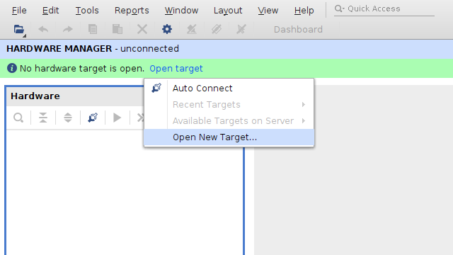
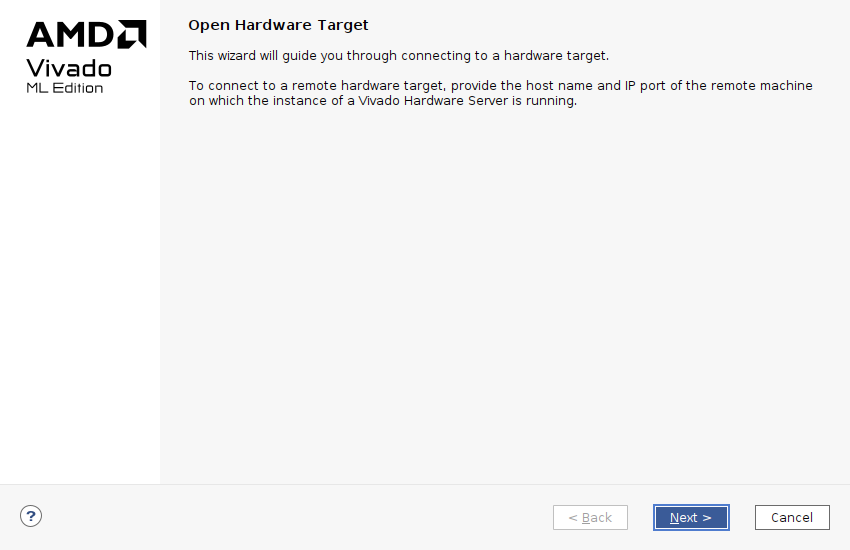
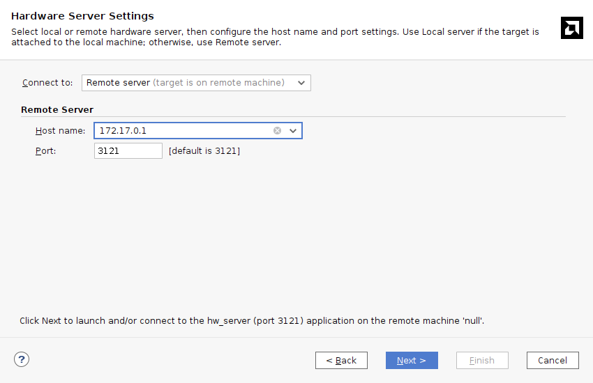
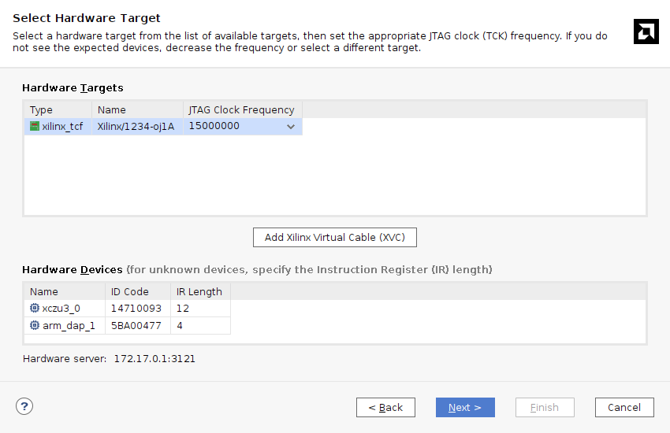
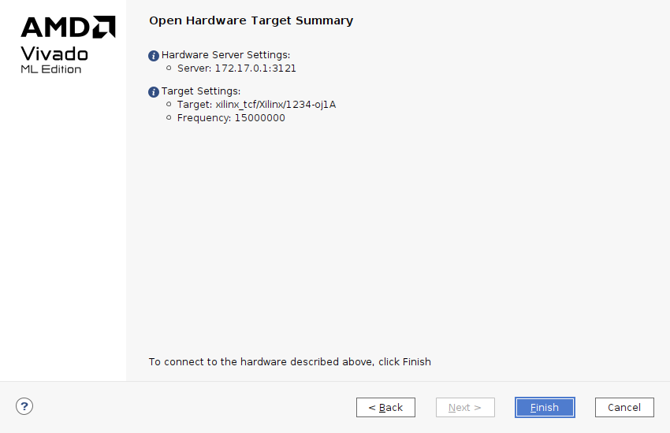
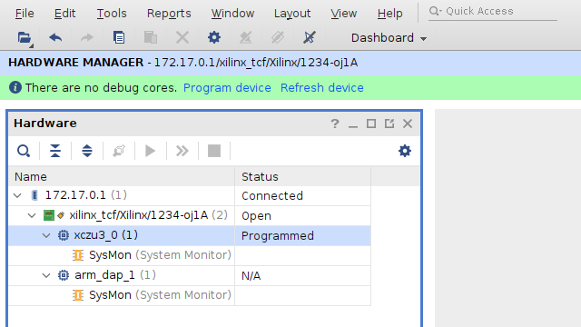

以前 (といっても6年近く前なんですね…) かいた[「Xilinx の開発ツールを Docker コンテナに閉じ込める」](/blog/2018/09/15/install-xilinx-tools-into-docker-container/)がそこそこ反響あったみたいです。やっぱり環境構築の流用性や再現性向上であったり、CI/CD 含む build automation の需要は FPGA 界隈にもあったんだなーという感じです。単純に Docker だとかコンテナ技術だとかの流行りに乗っただけというのもあるかもですが、いずれにしてもこうしたツールや技術が FPGA 界隈で少しでも注目されたのならよかったかなと思います。

あれから状況はかなり変わりました。Xilinx は AMD になったり、SDK は Vitis になったり、その Vitis も最近のバージョンで様相が大きく変わったり、20 GB もなかった Single-File Download Installer が今は 100 GB を超えてたり…

ということで、最近の状況を反映した補足記事を自分のメモもかねてかいておくことにしました。なお、本記事は Vivado のみをコンテナ化の対象とします。自分は Vitis も PetaLinux Tools もほとんど使わなくなってしまったので…[^1] また念のためかいておきますが、**本記事および上記の前回の記事で取り上げている内容は AMD/Xilinx が公式で示しているものではありません。ここに記載した情報の利用により発生したいかなるトラブルについても、自己責任でお願いします。**

本記事で紹介する `Dockerfile` と関連ファイルは GitHub リポジトリ [Tosainu/docker-vivado][github-repo] にあり、記事執筆時点での最新は [`55d9fc2`][github-repo-hash] です。

[^1]: Vivado で `.xsa` 出力までして、それ以降は XSCT/XSDB を直叩きか自前の Tcl スクリプトでファームウェアのロードやデバッグ、というワークフローが身につきました。

## 環境

Arch Linux (x86_64, `linux-6.9.7-arch1-1`) と、`pacman` 経由でインストールした `docker-1:27.0.3-1`, `docker-buildx-0.15.1-1`,  を使い、コンテナイメージの作成およびコンテナ化した Vivado の実行を確認しました。また、インストールする Vivado のバージョンは 2024.1 としました。

<details>

```
$ pacman -Qi linux docker docker-buildx
Name            : linux
Version         : 6.9.7.arch1-1
Description     : The Linux kernel and modules
Architecture    : x86_64
URL             : https://github.com/archlinux/linux
Licenses        : GPL-2.0-only
Groups          : None
Provides        : KSMBD-MODULE  VIRTUALBOX-GUEST-MODULES  WIREGUARD-MODULE
Depends On      : coreutils  initramfs  kmod
Optional Deps   : wireless-regdb: to set the correct wireless channels of your country [installed]
                  linux-firmware: firmware images needed for some devices [installed]
Required By     : None
Optional For    : base
Conflicts With  : None
Replaces        : virtualbox-guest-modules-arch  wireguard-arch
Installed Size  : 134.14 MiB
Packager        : Jan Alexander Steffens (heftig) <heftig@archlinux.org>
Build Date      : Fri 28 Jun 2024 01:32:50 PM JST
Install Date    : Fri 05 Jul 2024 05:58:57 PM JST
Install Reason  : Explicitly installed
Install Script  : No
Validated By    : Signature

Name            : docker
Version         : 1:27.0.3-1
Description     : Pack, ship and run any application as a lightweight container
Architecture    : x86_64
URL             : https://www.docker.com/
Licenses        : Apache-2.0
Groups          : None
Provides        : None
Depends On      : glibc  bridge-utils  iproute2  device-mapper  sqlite  systemd-libs  libseccomp  libtool  runc  containerd
Optional Deps   : btrfs-progs: btrfs backend support [installed]
                  pigz: parallel gzip compressor support
                  docker-scan: vulnerability scanner
                  docker-buildx: extended build capabilities [installed]
Required By     : None
Optional For    : None
Conflicts With  : None
Replaces        : None
Installed Size  : 107.21 MiB
Packager        : Lukas Fleischer <lfleischer@archlinux.org>
Build Date      : Tue 02 Jul 2024 06:15:54 AM JST
Install Date    : Fri 05 Jul 2024 05:58:54 PM JST
Install Reason  : Explicitly installed
Install Script  : No
Validated By    : Signature

Name            : docker-buildx
Version         : 0.15.1-1
Description     : Docker CLI plugin for extended build capabilities with BuildKit
Architecture    : x86_64
URL             : https://github.com/docker/buildx
Licenses        : Apache-2.0
Groups          : None
Provides        : None
Depends On      : None
Optional Deps   : None
Required By     : None
Optional For    : docker
Conflicts With  : None
Replaces        : None
Installed Size  : 54.48 MiB
Packager        : Christian Heusel <gromit@archlinux.org>
Build Date      : Wed 19 Jun 2024 05:27:07 AM JST
Install Date    : Fri 21 Jun 2024 11:44:22 PM JST
Install Reason  : Explicitly installed
Install Script  : No
Validated By    : Signature

$ docker version 
Client:
 Version:           27.0.3
 API version:       1.46
 Go version:        go1.22.4
 Git commit:        7d4bcd863a
 Built:             Mon Jul  1 21:15:54 2024
 OS/Arch:           linux/amd64
 Context:           default

Server:
 Engine:
  Version:          27.0.3
  API version:      1.46 (minimum version 1.24)
  Go version:       go1.22.4
  Git commit:       662f78c0b1
  Built:            Mon Jul  1 21:15:54 2024
  OS/Arch:          linux/amd64
  Experimental:     false
 containerd:
  Version:          v1.7.18
  GitCommit:        ae71819c4f5e67bb4d5ae76a6b735f29cc25774e.m
 runc:
  Version:          1.1.13
  GitCommit:        
 docker-init:
  Version:          0.19.0
  GitCommit:        de40ad0

$ sha256sum FPGAs_AdaptiveSoCs_Unified_2024.1_0522_2023_Lin64.bin 
9a04ad206be0d9afd9d11cd7997b4e6978485eee44f47d4c08d07dbc30cb2f1e  FPGAs_AdaptiveSoCs_Unified_2024.1_0522_2023_Lin64.bin

$ md5sum FPGAs_AdaptiveSoCs_Unified_2024.1_0522_2023_Lin64.bin   
8b0e99a41b851b50592d5d6ef1b1263d  FPGAs_AdaptiveSoCs_Unified_2024.1_0522_2023_Lin64.bin
```

</details>

## Web Installer で Batch Mode インストール

前回の記事では Single-File Download (SFD) Installer を使っていました。名前の通り必要なものがすべて含まれていて、オフライン実行も想定しているインストーラーです。実行時に追加のダウンロードが発生せず、AMD/Xilinx アカウント情報を入力しなくてよいため `Dockerfile` 記述に都合よかったのでした。

しかし、今の SFD Installer は 100 GB を超えています。いくら汎用 PC に載せられるストレージが高速かつ大容量になってきているとはいえ、Docker でこのクラスのコンテナイメージを扱うのはなかなか辛いものがあります。もちろん、いくら FPGA 開発環境を整えようとしている PC であっても、いつもストレージに余裕があるとは限りません。また今回対象としている Vivado だけに絞れば最終的なインストールサイズを 40 GB 以下にもできるので、事前に用意するデータが倍以上の大きさなのはもったいなさがあります。ということで、今回は Web Installer を使います。

最終的に `Dockerfile` に手順を落とし込みたいので、気になるのは Batch Mode がどうなるかです。Vivado Design Suite User Guide: Release Notes, Installation, and Licensing (UG973) の ["Batch Mode Installation Using Web Installer"](https://docs.amd.com/r/en-US/ug973-vivado-release-notes-install-license/Batch-Mode-Installation-Using-Web-Installer) セクションによれば、インストーラーを展開する操作と AMD/Xilinx アカウント情報を `xsetup -b AuthTokenGen` で入力する以外は基本的に同じ流れでよさそうです。しかしこの `xsetup -b AuthTokenGen`、メールアドレスとパスワードをコンソールからの入力で求めてきます。かわりになるコマンドラインオプションもおそらくなさそうですし、pipe で流し込もうとしてもだめでした。

    # echo -e "<email>\n<password>" | ./xsetup -b AuthTokenGen
    This is a fresh install.
    INFO Could not detect the display scale (hDPI).
           If you are using a high resolution monitor, you can set the insaller scale factor like this: 
           export XINSTALLER_SCALE=2
           setenv XINSTALLER_SCALE 2
    Running in batch mode...
    Copyright (c) 1986-2022 Xilinx, Inc.  All rights reserved.
    Copyright (c) 2022-2024 Advanced Micro Devices, Inc.  All rights reserved.
    INFO  - Internet connection validated, can connect to internet. 
    ERROR - FATAL Could not get a console!!! 
    
    Exception in thread "main" com.xilinx.installer.utils.k: Unable to progress with authentication token generation without access to a console.
            at com.xilinx.installer.cli.CLIActionHandler.f(Unknown Source)
            at com.xilinx.installer.cli.CLIActionHandler.a(Unknown Source)
            at com.xilinx.installer.cli.g.a(Unknown Source)
            at com.xilinx.installer.api.InstallerLauncher.main(Unknown Source)

そこで今回は [Expect](https://www.nist.gov/services-resources/software/expect) を使います。Expect は、CUI 動作の対話型アプリケーションをスクリプトで自動化できるソフトウェアです。スクリプトが FPGA ではおなじみの Tcl ベースなのも、なんだか相性のよさを感じます。

```tcl
set executable [lindex $argv 0];
set secret_file [lindex $argv 1];

set fd [open "$secret_file"]
set secret [split [read $fd] "\n"]
set username [lindex $secret 0]
set password [lindex $secret 1]
close $fd

set timeout -1

spawn "$executable" -b AuthTokenGen
expect {
  -re ".*E-mail Address:" {
    send -- "$username\r"
    exp_continue
  }
  -re ".*Password:" {
    send -- "$password\r"
    exp_continue
  }
  eof
}
exit [lindex [wait] 3]
```

スクリプトはコマンドラインの引数 `$argv` から2つの値を取ります。1つ目は `xsetup` を想定した実行ファイルへのパス、2つ目はメールアドレスとパスワードを記述したファイルへのパスです。メールアドレスとパスワードは、ファイルの1行目と2行目に順に記述されているものとします。`split` で分割し、それぞれを変数 `$username` と `$password` に格納しています。`spawn` で `xsetup -b AuthTokenGen` を実行し、続く `expect` で入出力を処理します。`xsetup` が `E-mail Address:` と表示したら `$username`、`Password:` と表示したら `$password` を入力、という操作が記述されています。

このスクリプトは `auth_token_gen.exp` と名前を付けて保存しました。メールアドレスとパスワードを記述したファイルを `secret.txt` とすれば、次のコマンドで `xsetup -b AuthTokenGen` がユーザー入力なしに完了します。

    $ expect -f auth_token_gen.exp /path/to/xsetup secret.txt 
    spawn /path/to/xsetup -b AuthTokenGen
    This is a fresh install.
    INFO Could not detect the display scale (hDPI).
           If you are using a high resolution monitor, you can set the insaller scale factor like this: 
           export XINSTALLER_SCALE=2
           setenv XINSTALLER_SCALE 2
    Running in batch mode...
    Copyright (c) 1986-2022 Xilinx, Inc.  All rights reserved.
    Copyright (c) 2022-2024 Advanced Micro Devices, Inc.  All rights reserved.
    INFO  - Internet connection validated, can connect to internet. 
    INFO  - In order to generate the authentication token please provide your AMD account E-mail Address and password.
     
    E-mail Address:xxx@xxx
    Password:
    INFO  - Generating authentication token... 
    INFO  - Saved authentication token file successfully, valid until 07/13/2024 12:40 AM 

そうしてできあがった `Dockerfile` がこんな感じです。

```dockerfile
FROM ubuntu:jammy AS base
RUN \
    apt-get update && \
    DEBIAN_FRONTEND=noninteractive apt-get install -y --no-install-recommends \
        expect file libgtk2.0-0 libncurses5 libswt-glx-gtk-4-jni libtinfo5 \
        locales python3 x11-utils xz-utils xvfb && \
    rm -rf /var/lib/apt/lists/* && \
    sed -i 's/^#\s*\(en_US.UTF-8\)/\1/' /etc/locale.gen && \
    dpkg-reconfigure --frontend noninteractive locales


FROM base AS installer
ARG INSTALLER_BIN=FPGAs_AdaptiveSoCs_Unified_2024.1_0522_2023_Lin64.bin
COPY --chmod=755 $INSTALLER_BIN /installer.bin
RUN /installer.bin --keep --noexec --target /installer


FROM installer AS do-install
ARG INSTALLER_CONFIG=install_config.txt
ARG INSTALLER_AGREED_EULA=XilinxEULA,3rdPartyEULA
COPY auth_token_gen.exp /
COPY $INSTALLER_CONFIG /install_config.txt
COPY --chmod=755 $INSTALLER_BIN /installer.bin
RUN --mount=type=secret,target=/secret.txt,id=secret,required=true \
    expect -f /auth_token_gen.exp /installer/xsetup /secret.txt && \
    /installer/xsetup -b Install -a "$INSTALLER_AGREED_EULA" -c /install_config.txt && \
    rm -rf /opt/Xilinx/.xinstall /opt/Xilinx/Downloads /opt/Xilinx/xic


FROM base
COPY --from=do-install /opt/Xilinx /opt/Xilinx
COPY --chmod=755 entrypoint.sh /
ENTRYPOINT ["/entrypoint.sh"]
CMD ["/bin/bash"]
```

`FROM ubuntu:jammy AS base` が、続く build stage のベースになります。主に APT のパッケージを追加しています。コンテナ化の対象を Vivado だけに絞ると依存パッケージは随分と減ります。なお、念のためかいておくと `ubuntu:jammy` は Ubuntu 22.04 です。最近リリースされた Ubuntu 24.04 は Vivado がまだ公式にサポートしておらず、実際 `libtinfo5` などが提供されていません。当面は 22.04 を使うのが無難そうです。

`FROM base AS installer` はインストーラーを展開しています。インストーラーの展開は、後述する操作のため独立した build stage になっています。Web Installer は SFD Installer と比較して十分に小さいので、コンテナの中に `COPY` してもそんなに辛くありません。また `COPY --chmod=755` で、元ファイルのパーミッション関係なしに実行可能権限を付けています。UG973 の通り、インストーラーの展開には `--keep`, `--noexec` および展開先 `--target <dir>` を付けて実行しています。

`FROM installer AS do-install` で、`install_config.txt` に応じたインストールをしています。`xsetup -b AuthTokenGen` は Expect 経由で、そのあとは SFD Installer のときと同様に `xsetup -b Install` という感じです。最後に使わないファイルを消しています。`secret.txt` は [Build secrets](https://docs.docker.com/build/building/secrets/) の仕組みを使って渡しています。カレントディレクトリに `secret.txt` がある場合、`docker build` に `--secret id=secret,src=secret.txt` を渡します。

最後の記述が最終的なコンテナイメージを定義しています。`do-install` でインストール自体は完了していますが、展開したインストーラーなど不要なファイルが含まれています。イメージサイズを少しでも削減するため `base` 作り直しています。`ENTRYPOINT` の行が、前回の記事でも取り上げたホストとコンテナ内の UID を一致させる hack です。本記事でも後述します。

## `install_config.txt` も Docker 経由で

Batch Mode のインストールでは、インストール内容の詳細をテキストベースの設定ファイルで指示できます。前述した `Dockerfile` 中の `install_config.txt` がこれに相当します。また、このファイルのテンプレートは `xsetup -b ConfigGen` で生成できます。

前回の記事でもそうしているように、拾ってきたバイナリはあまりそのまま実行したくないので、今回も Docker 経由で生成させます。せっかくなので、少し工夫してやります。

前のセクションで示したとおり、`Dockerfile` 中に、インストーラーを展開する build stage  `installer` があります。これを流用して、`xsetup -b ConfigGen` も実行します。今回は Vivado をインストールしたいので、`-p,--product`, `-e,--edition` にそれぞれ `Vivado`, `Vivado ML Standard` を指定します。また自分は `/opt` に入れたい派なので、`-l,--location` を `/opt/Xilinx` にしています。

```dockerfile
FROM installer AS do-configgen
ARG INSTALLER_PRODUCT=Vivado
ARG INSTALLER_EDITION="Vivado ML Standard"
RUN /installer/xsetup -b ConfigGen -p "$INSTALLER_PRODUCT" -e "$INSTALLER_EDITION" -l /opt/Xilinx
```

`xsetup -b ConfigGen` は、生成したテンプレートを `~/.Xilinx/install_config.txt`、つまり今回の場合 `/root/.Xilinx/install_config.txt` に出力します。これをいい感じに取り出しましょう。`Dockerfile` に次の記述も追加します。これは `/install_config.txt` **のみ**が含まれるコンテナイメージを生成します。

```dockerfile
FROM scratch AS configgen
COPY --from=do-configgen /root/.Xilinx/install_config.txt /
```

そして次のコマンドを実行します。このコマンドは、上で定義したコンテナイメージを `docker run` などで実行可能な形式でロードするかわりに、コンテナを構成するファイルを `dest=` で指定したパス (`.` つまりカレントディレクトリ) に展開します。実行後、カレントディレクトリに `install_config.txt` が存在するのを確認できると思います[^earthly-like]。

    $ docker build --target configgen --output type=local,dest=. .

あとは必要に応じて編集します。自分は開発対象が Zynq UltraScale+ MPSoC のみであるため、ディスクスペース削減を狙ってそれ以外をすべて無効にしています。この場合、最終的なコンテナイメージのサイズは約 35 GB になりました。

```ini
#### Vivado ML Standard Install Configuration ####
Edition=Vivado ML Standard

Product=Vivado

# Path where AMD FPGAs & Adaptive SoCs software will be installed.
Destination=/opt/Xilinx

# Choose the Products/Devices the you would like to install.
Modules=Virtex UltraScale+ HBM:0,Kintex UltraScale:0,Vitis Networking P4:0,Artix UltraScale+:0,Spartan-7:0,Artix-7:0,Virtex UltraScale+:0,Vitis Model Composer(Toolbox for MATLAB and Simulink. Includes the functionality of System Generator for DSP):0,DocNav:0,Zynq UltraScale+ MPSoC:1,Zynq-7000:0,Virtex UltraScale+ 58G:0,Power Design Manager (PDM):0,Vitis Embedded Development:0,Kintex-7:0,Install Devices for Kria SOMs and Starter Kits:0,Kintex UltraScale+:0

# Choose the post install scripts you'd like to run as part of the finalization step. Please note that some of these scripts may require user interaction during runtime.
InstallOptions=

## Shortcuts and File associations ##
# Choose whether Start menu/Application menu shortcuts will be created or not.
CreateProgramGroupShortcuts=1

# Choose the name of the Start menu/Application menu shortcut. This setting will be ignored if you choose NOT to create shortcuts.
ProgramGroupFolder=Xilinx Design Tools

# Choose whether shortcuts will be created for All users or just the Current user. Shortcuts can be created for all users only if you run the installer as administrator.
CreateShortcutsForAllUsers=0

# Choose whether shortcuts will be created on the desktop or not.
CreateDesktopShortcuts=1

# Choose whether file associations will be created or not.
CreateFileAssociation=1

# Choose whether disk usage will be optimized (reduced) after installation
EnableDiskUsageOptimization=1
```

[^earthly-like]: [この記事](/blog/2022/09/19/earthly-zynqmp/) でも紹介した、個人的に推している build automation tool の Earthly ライクの処理が、こうして素の Docker でも実現できます。このワークフローは、`docker-bake.hcl` と組み合わせるとより強力になります。[moby/buildkit](https://github.com/moby/buildkit) など moby 関連のリポジトリなどを中心に採用されています。

## ホスト - コンテナの UID/GID 問題

ホストのディレクトリを bind mount するのを前提としたコンテナイメージを扱うとき、問題になるのがホストとコンテナ内環境の UID/GID の違いです。Docker の場合コンテナ内の環境は Docker daemon と同じになるので、多くの場合 `root` になります[^docker-user]。このためコンテナ内で作成したファイルの所有権が `root` になってしまったり、既存ファイルのパーミッションを意図せず破壊してしまうこともあり面倒です。加えて、今回のような X11 アプリケーションを閉じ込める場合にも、ホスト - コンテナ内でユーザーが異なるのが問題になります。

[^docker-user]: 設定次第ではその限りではありません。またコンテナイメージの構築方法次第では、実行時のユーザーを変更する設定がなされていることもあります。

前回の記事では、`Dockerfile` の `ENTRYPOINT` を設定して、コンテナ起動時にホストと UID を一致させるユーザーを動的に作成していました。細かいところを若干かえつつ、今回も同じアプローチを実装します。コンテナに仕組んでいる `entrypoint.sh` がこちらです。

```sh
#!/bin/sh

set -e

if [ -n "$REUID" ] && [ -n "$REGID" ]; then
  groupadd --gid "$REGID" vivado
  useradd --shell /bin/bash --uid "$REUID" --gid vivado --create-home vivado
  if tty="$(tty)"; then
    chown vivado "$tty"
  fi
  unset REUID REGID
  export HOME=~vivado
  exec setpriv --reuid=vivado --regid=vivado --init-groups "$@"
else
  exec "$@"
fi
```

前回使っていた `gosu` は、util-linux の [`setpriv(1)`](https://man.archlinux.org/man/setpriv.1.en) に置き換えました。また、`setpriv(1)` のオプション名に合わせて `$USER_ID` 相当の変数は `$REUID`, `$REGID` に変更しました。それ以外は概ね同じです。目的のコマンド実行前にホストと UID/GID の同じユーザーを作成し、そのユーザーに切り替えてコマンド実行、をやっています。

コンテナイメージ名が `vivado:v2024.1` であるとして、実行例をいくつか示すとこんな感じです。

    $ id
    uid=1000(cocoa) gid=1000(cocoa) groups=1000(cocoa), ...

    $ docker run --rm vivado:v2024.1 id
    uid=0(root) gid=0(root) groups=0(root)

    $ docker run --rm -e "REUID=$UID" -e "REGID=$GID" vivado:v2024.1 id
    uid=1000(vivado) gid=1000(vivado) groups=1000(vivado)

    $ docker run --rm -e REUID=1234 -e REGID=5678 vivado:v2024.1 id
    uid=1234(vivado) gid=5678(vivado) groups=5678(vivado)

## コンテナ化した Vivado を起動する

Web Installer `FPGAs_AdaptiveSoCs_Unified_2024.1_0522_2023_Lin64.bin`, `secret.txt`, `install_config.txt` が準備できているとして、以下のコマンドでコンテナイメージを作成します。正常に終了すると、作成したイメージが `vivado:v2024.1` で呼び出せるようになるはずです。

    $ docker build --secret id=secret,src=secret.txt -t vivado:v2024.1 .

さっそく実行してみます。環境変数名が一部変わっただけで、前回とだいたい同じです。ホストの X11 を使えるようにするため環境変数 `$DISPLAY` を渡すのと、`/tmp/.X11-unix` を共有してやります。あとは前述した hack のため環境変数 `$REUID`, `$REGID`、プロジェクトなど作業領域のため例として `~/work/localhost/vivado` を bind mount します。

    $ docker run -it --rm -e "REUID=$UID" -e "REGID=$GID" -e DISPLAY -v /tmp/.X11-unix:/tmp/.X11-unix:ro -v ~/work/localhost/vivado:/work vivado:v2024.1
    vivado@e71b14e66945:/$

あとは `settings64.sh` を `source` して… となるのですが、いくつか注意点です。

まずは `vivado` を実行するディレクトリについてです。Vivado は初期状態でカレントディレクトリに `*.jou`, `*.log`, `*.str` といったファイルを出力してきてやや困ります。せっかくコンテナを使っているので、もしこれらファイルが不要の場合は、`~/` などコンテナの中でのみ有効な場所に移動するとよいです。

実行環境によっては、開いた Vivado のウィンドウが真っ白 (灰色？) になる場合があります。この場合、環境変数 `_JAVA_AWT_WM_NONREPARENTING=1` で解決する場合があります。

コンテナという特殊な環境ゆえに起きてしまう問題があるようです。例えば Synthesis を実行しようとすると次のようなエラーで落ちてしまいます。AMD/Xilinx 公式の見解ではないと注意書きがあるものの [Workaround が存在します](https://support.xilinx.com/s/article/000034450?language=en_US)。環境変数 `LD_PRELOAD=/lib/x86_64-linux-gnu/libudev.so.1` で回避できるようです。

<details>

```
realloc(): invalid pointer
Abnormal program termination (6)
Please check '/home/vivado/hs_err_pid61.log' for details
vivado@d481b2905345:~$ cat /home/vivado/hs_err_pid61.log
#
# An unexpected error has occurred (6)
#
Stack:
/lib/x86_64-linux-gnu/libc.so.6(+0x42520) [0x720e2ac42520]
/lib/x86_64-linux-gnu/libc.so.6(pthread_kill+0x12c) [0x720e2ac969fc]
/lib/x86_64-linux-gnu/libc.so.6(raise+0x16) [0x720e2ac42476]
/lib/x86_64-linux-gnu/libc.so.6(abort+0xd3) [0x720e2ac287f3]
/lib/x86_64-linux-gnu/libc.so.6(+0x89676) [0x720e2ac89676]
/lib/x86_64-linux-gnu/libc.so.6(+0xa0cfc) [0x720e2aca0cfc]
/lib/x86_64-linux-gnu/libc.so.6(realloc+0x36c) [0x720e2aca5aac]
/lib/x86_64-linux-gnu/libudev.so.1(+0x15707) [0x720e1e7e9707]
/lib/x86_64-linux-gnu/libudev.so.1(+0x1bb1b) [0x720e1e7efb1b]
/lib/x86_64-linux-gnu/libudev.so.1(+0x75ff) [0x720e1e7db5ff]
/lib/x86_64-linux-gnu/libudev.so.1(+0x7b6b) [0x720e1e7dbb6b]
/lib/x86_64-linux-gnu/libudev.so.1(+0x10192) [0x720e1e7e4192]
/lib/x86_64-linux-gnu/libudev.so.1(+0x105d3) [0x720e1e7e45d3]
/lib/x86_64-linux-gnu/libudev.so.1(udev_enumerate_scan_devices+0x2a1) [0x720e1e7e5341]
/opt/Xilinx/Vivado/2024.1/lib/lnx64.o/libXil_lmgr11.so(+0x12e165) [0x720e2172e165]
/opt/Xilinx/Vivado/2024.1/lib/lnx64.o/libXil_lmgr11.so(xilinxd_52bd866351b78202+0x9) [0x720e2172e5e9]
/opt/Xilinx/Vivado/2024.1/lib/lnx64.o/libXil_lmgr11.so(+0xdb467) [0x720e216db467]
/opt/Xilinx/Vivado/2024.1/lib/lnx64.o/libXil_lmgr11.so(xilinxd_52bd862318b59a70+0x86) [0x720e216db226]
/opt/Xilinx/Vivado/2024.1/lib/lnx64.o/libXil_lmgr11.so(+0xc879f) [0x720e216c879f]
/opt/Xilinx/Vivado/2024.1/lib/lnx64.o/libXil_lmgr11.so(xilinxd_52bd9e9e1c8e52fb+0x1b) [0x720e216d253b]
/opt/Xilinx/Vivado/2024.1/lib/lnx64.o/libXil_lmgr11.so(xilinxd_52bd700d1bd3c616+0x30) [0x720e216d25d0]
/opt/Xilinx/Vivado/2024.1/lib/lnx64.o/librdi_commonxillic.so(XilReg::Utils::GetHostInfo[abi:cxx11](XilReg::Utils::HostInfoType, bool) const+0x1a0) [0x720e26a80110]
/opt/Xilinx/Vivado/2024.1/lib/lnx64.o/librdi_commonxillic.so(XilReg::Utils::GetHostInfoFormatted[abi:cxx11](XilReg::Utils::HostInfoType, bool) const+0x59) [0x720e26a834a9]
/opt/Xilinx/Vivado/2024.1/lib/lnx64.o/librdi_commonxillic.so(XilReg::Utils::GetHostInfo[abi:cxx11]() const+0x103) [0x720e26a83763]
/opt/Xilinx/Vivado/2024.1/lib/lnx64.o/librdi_commonxillic.so(XilReg::Utils::GetRegInfo(std::__cxx11::basic_string<char, std::char_traits<char>, std::allocator<char> > const&, bool, bool)+0x96) [0x720e26a8a806]
/opt/Xilinx/Vivado/2024.1/lib/lnx64.o/librdi_commonxillic.so(XilReg::Utils::GetRegInfoWebTalk(std::__cxx11::basic_string<char, std::char_traits<char>, std::allocator<char> > const&)+0x60) [0x720e26a8aa30]
/opt/Xilinx/Vivado/2024.1/lib/lnx64.o/librdi_project.so(HAPRWebtalkHelper::getRegistrationId[abi:cxx11]() const+0x3d) [0x720e03a2256d]
/opt/Xilinx/Vivado/2024.1/lib/lnx64.o/librdi_project.so(HAPRWebtalkHelper::HAPRWebtalkHelper(HAPRProject*, HAPRDesign*, HWEWebtalkMgr*, std::__cxx11::basic_string<char, std::char_traits<char>, std::allocator<char> > const&)+0x178) [0x720e03a24c68]
/opt/Xilinx/Vivado/2024.1/lib/lnx64.o/librdi_tcltasks.so(+0x1e3b345) [0x720e1c43b345]
/opt/Xilinx/Vivado/2024.1/lib/lnx64.o/librdi_tcltasks.so(+0x1e44e97) [0x720e1c444e97]
/opt/Xilinx/Vivado/2024.1/lib/lnx64.o/librdi_common.so(+0xd85d9f) [0x720e2c985d9f]
/opt/Xilinx/Vivado/2024.1/lib/lnx64.o/libtcl8.6.so(TclNRRunCallbacks+0x47) [0x720e2b484497]
/opt/Xilinx/Vivado/2024.1/lib/lnx64.o/librdi_common.so(+0xd83693) [0x720e2c983693]
/opt/Xilinx/Vivado/2024.1/lib/lnx64.o/libtcl8.6.so(Tcl_ServiceEvent+0x7f) [0x720e2b5486df]
/opt/Xilinx/Vivado/2024.1/lib/lnx64.o/libtcl8.6.so(Tcl_DoOneEvent+0x149) [0x720e2b5489f9]
/opt/Xilinx/Vivado/2024.1/lib/lnx64.o/librdi_commontasks.so(+0x2bc9c7) [0x720e1ecbc9c7]
/opt/Xilinx/Vivado/2024.1/lib/lnx64.o/librdi_commontasks.so(+0x2c58fe) [0x720e1ecc58fe]
/opt/Xilinx/Vivado/2024.1/lib/lnx64.o/librdi_commontasks.so(+0x2c61df) [0x720e1ecc61df]
/opt/Xilinx/Vivado/2024.1/lib/lnx64.o/librdi_common.so(+0xd85d9f) [0x720e2c985d9f]
/opt/Xilinx/Vivado/2024.1/lib/lnx64.o/libtcl8.6.so(TclNRRunCallbacks+0x47) [0x720e2b484497]
/opt/Xilinx/Vivado/2024.1/lib/lnx64.o/librdi_commonmain.so(+0xe6d2) [0x720e2db7b6d2]
/opt/Xilinx/Vivado/2024.1/lib/lnx64.o/libtcl8.6.so(Tcl_MainEx+0x1a8) [0x720e2b543038]
/opt/Xilinx/Vivado/2024.1/lib/lnx64.o/librdi_common.so(+0xdaf42b) [0x720e2c9af42b]
/lib/x86_64-linux-gnu/libc.so.6(+0x94ac3) [0x720e2ac94ac3]
/lib/x86_64-linux-gnu/libc.so.6(clone+0x44) [0x720e2ad25a04]
```

</details>

これらすべてをまとめるとこんな感じ。

    $ docker run -it --rm -e "REUID=$UID" -e "REGID=$GID" -e DISPLAY -v /tmp/.X11-unix:/tmp/.X11-unix:ro -v ~/work/localhost/vivado:/work vivado:v2024.1
    vivado@e71b14e66945:/$ cd
    vivado@e71b14e66945:~$ . /opt/Xilinx/Vivado/2024.1/settings64.sh
    vivado@e71b14e66945:~$ _JAVA_AWT_WM_NONREPARENTING=1 LD_PRELOAD=/lib/x86_64-linux-gnu/libudev.so.1 vivado

あるいはコマンド1発だとこんな感じ。

    $ docker run \
        -it \
        --rm \
        -e "REUID=$UID" \
        -e "REGID=$GID" \
        -e DISPLAY \
        -v /tmp/.X11-unix:/tmp/.X11-unix:ro \
        -v ~/work/localhost/vivado:/work \
        vivado:v2024.1 \
        /bin/bash -c 'cd && . /opt/Xilinx/Vivado/2024.1/settings64.sh && _JAVA_AWT_WM_NONREPARENTING=1 LD_PRELOAD=/lib/x86_64-linux-gnu/libudev.so.1 vivado'

## Hardware Server を使う

前回の記事では、コンテナ内で動かした Vivado と実機を JTAG でつなぐために `--device` などを使って頑張っていました。この方式のデメリットは、USB-JTAG を抜き差しするなどして `--device` に渡したパスが消えたり変わった場合にコンテナごと起動しなおす必要があったことでした。

忘れがちですが、AMD/Xilinx のツールはいろんなものが client-server 方式になっています。ホストに最小限の AMD/Xilinx ツールチェインをインストールするのを許容できる場合、これを活用して問題をある程度解決できます。具体的にはホストに **Hardware Server** をインストール・実行し、コンテナ内の Vivado からそれにつないでやります。

早速インストールしていきます。これも、せっかくなのでコンテナイメージを作ったときのものを流用して Docker 経由でやってしまいましょう。インストーラーがホストの関係ないところまで触れる状態にあってほしくないので。まず `installer` build stage をコンテナイメージとしてロードします。

    $ docker build --target installer -t installer .

ホストの `/opt/Xilinx` を bind mount してコンテナを起動し、Hardware Server を Batch Mode でインストールします。Vitis や Vivado と比較すると非常に小さいのですぐに終わります。インストールが完了したらコンテナは終了します。作業後、ホストの環境に `/opt/xilinx/HWSRVR` が現れているはずです。

    $ docker run --rm -v /opt/xilinx:/opt/Xilinx -it installer
    root@b63451e812d3:/# /installer/xsetup -b AuthTokenGen
    root@b63451e812d3:/# /installer/xsetup -b Install -p 'Hardware Server' -e 'Hardware Server (Standalone)' -a XilinxEULA,3rdPartyEULA -l /opt/Xilinx

    $ ls /opt/xilinx/HWSRVR/
    2024.1/

USB-JTAG のパーミッション修正のための udev rules が設定されていない場合は設定します。`/opt/xilinx/HWSRVR/2024.1/data/xicom/cable_drivers/lin64/install_script/install_drivers/` の中にある `*.rules` ファイルを `/etc/udev/rules.d/` の中にコピーするか symlink を張ります。これで準備完了です。

    $ sudo cp /opt/xilinx/HWSRVR/2024.1/data/xicom/cable_drivers/lin64/install_script/install_drivers/*.rules /etc/udev/rules.d/

FPGA ボードと PC を USB-JTAG で接続します。FPGA ボードの電源を入れたら `hw_server` を起動します。

    $ /opt/xilinx/HWSRVR/2024.1/bin/hw_server

Vivado の Hardware Manager で "Open New Target" を選択します。



開いたダイアログの "Next" をクリック。



"Connect to" を "Remote server"、"Host name" にホストの IP アドレスを入力して "Next" をクリックします。今回は `docker0` インターフェイスに設定されていたアドレスを設定しました。



正常に接続されると "Hardware Targets", "Hardware Devices" に接続したデバイスが表示されるはずです。目的のものを選択して "Next" をクリックします。



"Finish" をクリック。



無事 FPGA ボードと接続されました。



ちなみに Hardware Server には `hw_server` のほか、`xsdb` なども含まれています。インストールしておけば、JTAG 経由の bitstream やアプリケーションのロードもできて便利です。

## おわり

最近の状況を反映しつつ、改めて Vivado を Docker コンテナに閉じ込める方法を紹介しました。また、前回の課題だった FPGA ボードとの JTAG 接続について、Hardware Server を使う方法を紹介しました。一連のファイルは GitHub リポジトリ [Tosainu/docker-vivado][github-repo] にあります。

クセや制約の多いソフトウェアも、工夫すれば意外となんとかなるものです。開発環境やその上でのワークフローは自分が使いやすいようにして損じゃないのは FPGA も同じだと思います。いい感じに工夫して付き合っていきたいですね。

[github-repo]: https://github.com/Tosainu/docker-vivado
[github-repo-hash]: https://github.com/Tosainu/docker-vivado/tree/55d9fc239b194372087bd4841d4131c181fe6263
