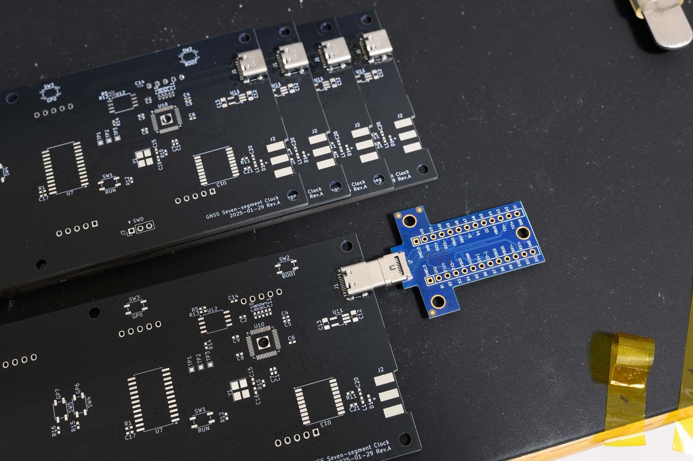

7セグメント LED を使ったデジタル時計を作りました。GNSS レシーバーを搭載していて、これで時刻を取得してくれます。KiCad プロジェクトとソフトウェアは [Tosainu/gnss-7-seg-clock](https://github.com/Tosainu/gnss-7-seg-clock) に置いています。

<iframe width="960" height="540" src="https://www.youtube-nocookie.com/embed/Y1P_iDvq4bk?si=hN1U6vSQ7WM-tLqw&rel=0" title="YouTube video player" frameborder="0" allow="accelerometer; autoplay; clipboard-write; encrypted-media; gyroscope; picture-in-picture; web-share" referrerpolicy="strict-origin-when-cross-origin" allowfullscreen></iframe>

このプロジェクトは、自分にとってはほぼ初めてのメカ・回路・ソフト全部やるプロジェクトでもありました。組み上がりからそこそこ経ちいまさら感ありますが、ついったに書くほどでもなかったこまごまとしたことを、特に回路・基板に関すること中心に紹介していきます。

## モチベーション

ここ何年かの自分の目標として、(ある程度簡単な) 基板は自分で設計&発注できるようにしたいというのがありました。

基板を設計して安価な製造業者に発注、というのは近年の電子工作であたりまえのスキルになりつつあると感じています。昔から電子工作に触れてきた身として、また組み込みシステムに関わるソフト開発者として、自分も基板設計はそろそろ身に付けておきたいとスキルだなと思っていました。また、最近は表面実装向けパッケージしかないパーツが増え、マイコンや FPGA の周辺回路として気になるIC を見つけてもユニバーサル基板とかじゃ厳しいなぁ…となるのも基板作れるといいなと感じる要因でした。度重なる挫折を経て昨年秋にようやく[ごく簡単な基板を作成](https://github.com/Tosainu/milkv-duo-iob)し、今度はもう少し複雑なものを作ってみようと画策していたところでした。

基板設計を身につけたいことに加えて、はんだ付け練習の機会を作りたいというのもありました。自分はもともとはんだ付けは得意な方だと思っていました。しかし、はじめて使う無鉛はんだや、ひょんなことから発生した M0603 チップ部品やピッチの狭い QFN パッケージのはんだ付けに苦戦し、ここ数年しばらく自信を無くしていました。もし基板から何か作るのであれば、表面実装パーツを優先的に採用し、ついでに練習しようと考えていました。

そんな中で電波時計とは別の方法で時間合わせする時計が欲しいなーというのと、GNSS モジュールを使った工作を見る機会があり刺激を受け「そうだ時計をつくろう、GNSS に同期するやつ」となったのでした。

<blockquote class="twitter-tweet" data-dnt="true">
GNSS レシーバーのせた卓上時計を作りたい気がしてきた
&mdash; ✧*。ヾ(｡ᐳ﹏ᐸ｡)ﾉﾞ。*✧ (@myon___) <a href="https://twitter.com/myon___/status/1876953547507454245?ref_src=twsrc%5Etfw">January 8, 2025</a></blockquote> 

## 回路・基板設計

### 設計から基板発注まで

先行事例は何かないかなと「diy digital clock」などで調べていたところ、[Kello version 4](http://kair.us/projects/clock/v4/index.html) という作品を見つけました。これにインスパイアされて「GNSS で時刻合わせする7セグ6桁表示の時計」とコンセプトを定めました。そこから基板やパーツ発注までは次の流れで進めました。

1. 主要パーツの選定
2. 各主要パーツの周辺回路検討
3. 基板にパーツを仮配置　
4. RP2040 のピンアサイン決定
5. 回路・基板レイアウトの微調整

最初に回路を構成する主要なパーツ、7セグメント LED・マイコン・GNSS モジュールについて、できるだけ具体的な型番まで決めました。

- 1.5" サイズの7セグメント LED
- [Raspberry Pi RP2040][RP2040]
- [u-blox MAX-M10S][MAX-M10S]

7セグメント LED は、6つ並べたときの大きさ (おおよその完成サイズ) と USB の5V 駆動を見据えた順方向電圧から 1.5" サイズとしました。RP2040 は Rust を使った開発体験含めて最近気に入っていることのほか、0.2mm ピッチの QFN56 で手はんだがなかなかの難易度だとのウワサでぜひ挑戦したいと採用しました。GNSS モジュールは、時刻情報取得だけに使うにはややオーバーキルで高価な気もしましたが MAX-M10S にしました。手はんだできるパッケージで入手性も悪くないこと、そしてやっぱり最新世代のものを使いたいよねということで。

次に、上であげた各パーツの周辺回路をざっくりと決めました。この段階で、パーツのパッケージサイズもだいたい確定させました。チップ部品は原則 M1005 縛りでいこうと決めたのもこのあたりです。そして、基板全体に必要なパーツがだいたい明らかになったところで一旦基板のレイアウト設計に移り、パーツを仮配置しました。

だいたいの基板サイズやパーツ配置が形になってきたところで、配線のしやすさなども考慮しながら RP2040 のピンアサインを含む回路の細部や基板レイアウトをあーでもないこーでもないと仕上げていきました。ここが一番時間がかかった気がします。細かいところが気になり、作業のやめ時を見失って何度も「気づいたら朝」をやっていました。慣れてきたらもう少しスパッと描けるようになったりするんですかね。

最終的に発注するパーツの決定は、上記設計プロセスのかなり後段で行いました。結果としてこれはあまりよいアイデアとはいえず、今後の開発に向けた反省点となりました。今回はパーツを DigiKey にまとめて発注したいと考えていました。しかし、大雑把なパーツ選定のまま基板レイアウトを細かいところまで描き進めてしまった結果、いざ発注のことを考え始めたフェーズで在庫がないパーツなどが見つかってしまいました。代替品を探したり、それに伴う回路・基板レイアウト変更が発生し、より時間をかけてしまうことになりました。

ちなみに回路図は[これ](./sch.pdf)、基板が[これ](./pcb.pdf)、そして1台あたりに必要なパーツはこんな感じになりました。

| Reference | Value | Parts | Qty |
| --- | --- | --- | --: |
| `C1`, `C2`, `C4-C10`, `C14`, `C17-C19` | MLCC, 0.1uF, 10%, 6.3V, X5R, M1005 | | 13 |
| `C3`, `C11` | MLCC, 1uF, 20%, 6.3V, X5R, M1005 | | 2 |
| `C12`, `C13` | MLCC, 10uF, 10%, 6.3V, X7R, M2012 | | 2 |
| `C15`, `C16` | MLCC, 15pF, 5%, 50V, C0G/NP0, M1005 | | 2 |
| `C20` | MLCC, 10000pF, 10%, 16V, X7R, M1005 | | 1 |
| `C21` | MLCC, 47pF, 5%, 50V, C0G/NP0, M1005 | | 1 |
| `D1` | Bidirectional TVS, M1005 | [Littelfuse PESD0402-140][PESD0402-140] | 1 |
| `D2-D7` | LED, M1005 | | 6 |
| `J1` | USB-C Receptacle | [GCT USB4105-GF-A](https://gct.co/connector/usb4105) | 1 |
| `J2` | SMA Receptacle, Edge Mount | [Molex 732511153][732511153] | 1 |
| `J3` | Pin header, 01x03, P2.54 mm | | 1 |
| `L1` | Inductor, 27nH, 5%, M1005 | [Murata LQG15HS27NJ02D][LQG15HS27NJ02D] | 1 |
| `R1-R3` | Resistor, 2.2kOhm, 1%, 1/16W, M1005 | | 3 |
| `R4`, `R5`, `R12`, `R14-R16` | Resistor, 10kOhm, 1%, 1/16W, M1005 | | 6 |
| `R6`, `R7` | Resistor, 5.1kOhm, 1%, 1/16W, M1005 | | 2 |
| `R8`, `R9` | Resistor, 27Ohm, 1%, 1/16W, M1005 | | 2 |
| `R10`, `R13` | Resistor, 1kOhm, 1%, 1/16W, M1005 | | 2 |
| `R11` | Resistor, 10Ohm, 5%, 1/4W, M1005 | | 1 |
| `R17-R22` | Resistor, 470Ohm, 1%, 1/16W, M1005 | | 6 |
| `SW1-SW5` | Tactile Switch | [C&K PTS810][PTS810] | 5 |
| `U1-U6` | 7-segment LED, Common-Anode, 3.81 mm | | 6 |
| `U7-U9` | 16-ch LED sink driver, SOIC-24W | [TI TLC5925IDWR][TLC5925IDWR] | 3 |
| `U10` | MCU | [Raspberry Pi RP2040][RP2040] | 1 |
| `U11` | LDO, 3.3V, 500 mA, SOT-23-5 | [TI TLV75533PDBVR][TLV75533PDBVR] | 1 |
| `U12` | SQPI NOR Flash, 32M-bit, SOIC-8 | [Winbond W25Q32JVSS][W25Q32JV] | 1 |
| `U13` | GNSS Receiver | [u-blox MAX-M10S][MAX-M10S] | 1 |
| `Y1` | Crystal, 12MHz | [Abracon ABM8-272-T3][ABM8-272-T3] | 1 |
| | GNSS Active Antenna | [u-blox ANN-MB5][ANN-MB5] | 1 |

### 7セグどうやって制御するか問題

7セグメント LED の多くは数字部分を構成する7つ (A…G) と右下のドット (dp) の8ブロックの LED を持ち、アノードまたはカソードを束ねて出した2ピンと個々の LED につながる8ピンとなっています。つまり6桁表示の場合、8 x 6 = 48 個の LED を光らせるのと同じです。当然 RP2040 に48個も GPIO はないので、なんらかの工夫が必要です。

たくさんの LED を制御するにあたって、いくつかのブロックに分けて高速に切り替えて点灯させる (LED multiplexing, あるいは日本語圏固有の呼び方？としていわゆるダイナミック制御) と、シフトレジスタを使う方法、あるいは両者を組み合わせる方法が有名だと思います。今回はシフトレジスタ、とくに Kello でも使われていた LED 特化を謳う [TI TLC5925IDWR](TLC5925IDWR) を3つ直列にして制御することにしました。データを実質 SPI で流し込めるのでマイコン間の配線を大幅に減らせるほか、`LE` ピンの制御で全ピンの出力を一斉に更新できるのが GNSS レシーバーの1 Hz パルス出力と相性よさそうだと感じたためです。また7セグ LED は数字部分と dp で構成する LED の数が違うためか順方向電圧が違ったりします。定電流源として扱える TLC5925 のおかげで、出力ごとに異なるパラメーターを計算しなくて済んだのもメリットといえそうです。

LED に流す電流は `R-EXT` ピンと `GND` ピン間を流れる電流で制御、多くの場合 `R-EXT` - `GND` 間に適当な抵抗を入れればよいようです。10mA 程度を流したかったので、データシート中の計算式をもとに 2.2kOhm を入れました。

### 7セグの選択肢・調達先少なすぎ問題

さて、時刻表示を7セグメント LED にしようと決めたものの… 選択肢や調達先がとても少ないのに驚きます。特に 1" 以上の大きさとなると数個ほどの候補しかありませんでした。

前述の通り、完成品のサイズ感や電源を USB の5Vととした制約から7セグは 1.5" サイズの高輝度タイプでないものと決めました。当初 [Kingbright SA15-11GWA][SA15-11GWA] を載せようとしたもののどこにも在庫がなく断念。最終的に [WENRUN LSD150BAG-101][LSD150BAG-101] に決めました。今回は電子パーツ類のほぼ全てを Digikey で揃えているのですが、これだけ別で **TME** というところにに発注しています。TME は初めて聞くサイトだったのでとても不安でしたが、特に大きな問題もなく、さらに注文から数日で届いたりと悪くない体験でした。

ところで7セグメント LED のパッケージには何か規格がある感じではなく、概ねどのモデルも上下に5ピンずつでピンアサインも同一であるものの微妙にピッチが違うなどしていました。今回使った 1.5" サイズでは、縦方向のピンの間隔が大きく分けて2つ、40.64mm (SA15-11GWA) と 40.00mm (LSD150BAG-101) のものがありました。最終的にどちらでも採用できるよう、ランドを内側に 0.32mm のばして楕円形にしたフットプリントを使いました。

### RP2040

RP2040 まわりの回路や基板レイアウトは、Raspberry Pi 公式に [Hardware design with RP2040][HDwRP2040] というとても親切な資料があるのでほとんど迷うことなく進められました。また、Raspberry Pi Pico の回路図 ([Raspberry Pi Pico Dtatasheet][Pico-DS]) はチップ部品のサイズや許容誤差まで書かれていてパーツ選定にとても参考になりました。そのほか、USB-C や電源周りなどで [Adafruit Feather RP2040](Feather-RP2040) の回路図も参考にしました。

手はんだのため、フットプリントは KiCad の標準ライブラリに含まれているものをベースに変更を加えました。はんだコテを当てやすくするため pad を伸ばし、また底面は基板の裏面からはんだを流し込む穴を開けています。また、実装後の同通確認のためテストポイントを作るなどして GPIO を全て引き出したりもしています。

データシートの記述にある通り、RP2040 底面の GND pad は一般の QFN-56 より小さく、あいたスペースにに配線を通しやすいとしています。実際、Minimal Design Example では zone fill を駆使して 3.3V と 1.1V のラインが詰め込まれていました。

> NOTE: There is no standard size for the central GND pad (or ePad) with QFNs. However, the one on RP2040 is smaller than most. … This gives the opportunity to route between the central pad and the ones on the periphery, which can help with maintaining power and ground integrity on cheaper PCBs. …

この真似をするのがなかなかに大変でした。単に zone fill のパラメータをコピペするだけではうまくいかず、何度もパラメーターや zone の形を調整することになみました。特に別の zone と重なったときの優先度を指示する z-index 的なパラメーターは、ある時点までうまくいっていたのに別の箇所を変更したときにこわれて再調整、が何度も発生してつらかったです。また、ピッチの狭さのために zone と pad の接続が悪いと DRC におこられることもありました。対策として track を引いたり、部分的に pad の接続を fill にしたりしました。なお、このせいで一部のピンのはんだの乗りがものすごく悪くなり、実装の際にとても苦労することになりました。

### 電源

給電用の DC ジャックなどを設けず USB だけで動作し、かつ回路をできるだけ簡単にしたいという方針で電源まわりを検討しました。USB の 5V を LDO で3.3Vに落として IC などに供給、順方向電圧が少なくとも4Vを超える7セグメント LED は USB の5Vをそのまま入れています。

LDO には [TI TLV75533PDBVR][TLV75533PDBVR] を使いました。単価が比較的安く、また広い周波数域で PSRR がそこそこよいのが特徴かなと思っています。回路への給電が USB になるので、つまり開発時などでは PC から、常用時は AC アダプターなどからと様々な電源が想定されます。広い周波数域で PSRR がよいのはきっといい感じに動いてくれると期待しています。

LDO の入出力に置くコンデンサの選定には少し悩みました。データシートによれば DC bias characteristics を考慮しつつ入力側に最低 1uF+、出力側に 0.47uF+ を入れろとあります。DC bias characteristics ってなんだと調べると、MLCC などには印加する電圧が上がるとともに実効的な静電容量が減ってしまう特性だとのことでした。最終的に 10uF, 10%, 6.3V, X7R の MLCC にしました。さらに念のため、一般的にサイズが大きくなるほど DC bias characteristics による静電容量低下が少ないのをうけて、ここだけ他より大きいサイズ (M1005 -> M2012) としました。

…などといろいろ書きましたが、この辺りに関してはまだなんとなくでしかわかっていないことがたくさんです。とはいえ、電源といえば LM7805 みたいな3端子レギュレーターで入出力に適当な電解コンデンサ置けばおｋ程度の知識で止まっていたのでいろいろ勉強になりました。

### MAX-M10S

設計にあたって一番不安だったのが MAX-M10S まわり、特に RF 側の回路と基板レイアウトでした。公式の [Integration Manual](https://www.u-blox.com/en/product/max-m10-series?legacy=Current#Documentation-&-resources) のほか、[SparkFun GNSS Receiver Breakout - MAX-M10S](https://github.com/sparkfun/SparkFun_u-blox_MAX-M10S) が回路・基板レイアウト含めて公開されていてとても参考になりました。

今回の回路図がこれです。

`D1` は SparkFun GNSS Receiver Breakout にならって入れた TVS、そのほかは Integration Manual 中の Reference Design における次のパーツに相当します。なお、DC Block Capacitor とした `C21` は今回の回路では必要なさそうだったことが明らかになっています。MAX-M10S が内部に DC Block Capasitor に相当するものを持っているため、Reference Design のように外付けの SAW filter などを設けないのであれば不要そうです。

| gnss-7-seg-clock | Reference design | Use |
| --- | --- | --- |
| `C20` | `C14` |  RF Bias-T Capacitor |
| `C21` | `C18` | DC Block Capacitor |
| `L1` | `L3` | RF Bias-T Inductor |
| `R11` | `R8` | Antenna supervisor current limiter/shunt resistor |

SMA コネクタにつながる配線は 50Ohm程度のインピーダンスになるのを期待して太くしています。

## 基板実装

永遠に KiCad とにらめっこが続きそうなのをなんとか打ち切り発注。基板とパーツ、そのほか追加の工具類などが2月はじめごろに揃いました。

はじめに書いた通り、はんだ付けの練習が今回のモチベーションの1つです。実装予定のパーツの大半が、これまでほとんど経験してこなかったピッチの狭いパーツです。ちゃんと実装できるか不安だったので、USB-C コネクタから始めて、少しずつ外観・通電チェックをしていきながら実装していきました。また、特に自信のなかったパーツは、少しもったいなくはありますが予備の基板とパーツも使って繰り返し実装しました。

USB-C コネクタは自信のなかったパーツの1つです。通電確認のために、Saiko Systems の [USB Type C Male Plug Breakout board v3.0](https://www.saikosystems.com/web/p-89-usb-type-c-male-plug-breakout-board-v30.aspx) を用意しました。USB-C のピンを引き出す基板はいろいろ見つかりますが、給電を目的に5.1kOhm が実装されたものがほとんどで微妙でした。一方、この Breakout board は単純にピンを引き出すだけのものなので今回の用途にピッタリでした。とても活躍してくれて、最終的に USB-C コネクタを実装した5枚の基板全てはんだブリッジや接続不良ないのが確認できました。Saiko[^saiko] です。

[^saiko]: 社名の由来が本当に日本語の「最高」っぽくてびっくりする https://www.saikosystems.com/web/t-about.aspx

USB-C コネクタの次は LDO → 外観・通電チェック → RP2040 → 外観チェック → RP2040 の動作に最低限必要なパーツ類 → 外観チェックと進めていきました。そして、残りのパーツを実装する前に RP2040 を動かしてみることにしました。最初に準備できた基板は USB でつないで認識してくれたものの、RP2040 がややパターンからずれてしまっていて QSPI Flash との接触不良を解決できず… 2枚目でなんとか動いてくれました。RP2040、やっぱり手強かった… ただ、RP2040 ははんだ付け作業自体はそこまでの難しさではなく、付け始めるときにどれだけ正確な位置に RP2040 を配置できるかが一番難しく重要な作業なのかなと思います。ちょっとした振動でブレたりしてなかなか難しかったです。数ピンだけでもはんだが付いてしまえば、あとは引きはんだの要領で慣れてくるとそこそこスムーズにいけました。基板設計のセクションで少し触れた通り、3.3Vや1.1Vにつながる箇所が基板レイアウトの都合上はんだの乗りがとても悪く、ここだけは引きはんだも思ったようにいかず苦戦しましたが。

<blockquote class="twitter-tweet" data-dnt="true">
RP2040 なかなかてごわかった (まだ QSPI あたりのピンに接触不良ありそうで書き込みできても verify とおらない) <a href="https://t.co/JatUvKESoz">pic.twitter.com/JatUvKESoz</a>
&mdash; ✧*。ヾ(｡ᐳ﹏ᐸ｡)ﾉﾞ。*✧ (@myon___) <a href="https://twitter.com/myon___/status/1888370352629432772?ref_src=twsrc%5Etfw">February 8, 2025</a></blockquote> 

GPIO を ON/OFF したりするコードを走らせて全ピンの導通確認をしていたときの様子。この段階で、まだパーツを実装し切っていないけれどもかなりの達成感でした。

<blockquote class="twitter-tweet" data-media-max-width="960" data-dnt="true">
！！！！！！ (あさあげた基板は一旦あきらめて2枚目実装した) <a href="https://t.co/01LhiGSWTM">pic.twitter.com/01LhiGSWTM</a>
&mdash; ✧*。ヾ(｡ᐳ﹏ᐸ｡)ﾉﾞ。*✧ (@myon___) <a href="https://twitter.com/myon___/status/1888485721947939038?ref_src=twsrc%5Etfw">February 9, 2025</a></blockquote> 

その後、MAX-M10S や 7セグメント LED をつけて完成です。よく見ると RP2040 右上の2ピンがブリッジしていますが、どちらも3.3Vが入るピンなので一応問題ないです。いや、ほんとにはんだの乗りが悪くてですね… これ以上なんとかしようとしてレジストやパターン剥がれても困るので気にしないことにしました。

ちなみに「外観チェック」のために[インスペクションルーペ][SL-55]を用意していました。数千円からでも導入できて手頃だった一方、物体にかなり近寄らないとだめなのが微妙でした。今回でいうと例えば RP2040 のはんだ付け状況確認のためややナナメから見るとかがやや難しかったです。また、物体に近づくと影を作ってしまうので、周辺に十分な光源も必要でした。ひとまず手持ちのビデオライトを横に作業し、[後日デスクライトを導入](https://x.com/myon___/status/1914999253350666474)するきっかけの1つとなったのでした。

道具に関してもう1点、はんだコテのコテ先選びの重要性も痛感しました。細かいパーツを付けるからと細いコテ先 (HAKKO T18-CF1) を用意しましたが、熱の伝わりなど逆に扱いが難しく、結局大半の M1005 を付けるとき以外ははんだコテ (HAKKO FX-600) 付属のコテ先 (HAKKO T18-B) に戻して作業しました。なんなら M1005 でさえ付属のコテ先の方が付けやすかったのではと思ったり。それと同時に、付属のコテ先は必ずしもベストなチョイスでなくても多くの場面をそつなくこなしてくれるので "付属" なのかなぁと思ったりするのでした。コテ先、奥が深い… 機会があれば他の形状も試してみたいですね。

## メカ

基板を傾斜をつけて立たせるスタンドと、特に日中の7セグメント LED の見やすさ改善のためスモークアクリル板をつけたいと考えていました。とはいえメカに関しては回路以上に知見がなく、でもせっかくの機会なので多少の加工は自分でしたいという思いがありました。そこで、今回穴あけはドリルを購入し自分でやるとし、それ以外の素材の加工が発生しなくて済む方法を検討しました。

スタンドはやはり安定感が欲しく、十分な強度とある程度の重さがあるアルミ材を選択しました。フラットバーやアングルといった規格材の組み合わせで済む構造で設計し、[横山テクノ](https://www.yokoyama-techno.net/)というショップでカットされたものを調達しました。

スモークアクリル板は、[はざいや](https://www.hazaiya.co.jp/)よりサイズ指定のカットと端面処理されたものを調達。そのほかネジ類を[ウィルコ](https://wilco.jp/)で揃えました。どのショップも個人でかつ少量の発注ができて助かりました。

設計には FreeCAD を使いました。KiCad で出力した VRML モデルをインポートできたりするのは、パーツやネジが干渉しないかの確認にとても役立ちました。なお、シルクをモデルに含めた場合などは特に重くなるので注意です。「(✿╹◡╹)ﾉ」がどのくらい隠れてしまうか確認したかったので、下のスクショではシルク入りモデルをインポートしたあとで不要なものを非表示にしています。

FreeCAD では、Sketcher などを使ってモデリングし、TechDraw の図面を見ながらパーツを加工しました。むかし Google SketchUp で遊んでいたので Sketcher に戸惑うことはなかったものの、ある面を基準にした sketch を作成しようとしたときの挙動の一貫性のなさ (？) であったり、いかにも「Python で動いています！」感ある (Traceback が出てくるとか) 結局何が悪いのかわかりづらいエラーメッセージであったり、(これは FreeCAD 悪くないですが) Wayland 環境に起因する不安定さであったりで、正直あまり快適ではありませんでした。なんかいい代替ツールないかなぁ…[^blender]

[^blender]: 「せっかく 3D モデル作ったんだしいい感じにレンダリングしたい」と [Blender を触ってみたり](https://x.com/myon___/status/1903611560897257877)、そこからさらに Blender が代替ツールにできないかと検討したりもしました。やっぱり目的が違うので難しそうですね。ところで CAD 類って全部キーボードやマウスの操作が違って、ツールによっては再割り当てできなかったりもするので、扱わないといけないソフトが増えるとどんどん辛くなるのなんとかして欲しい。

ということでスタンドとフロントパネルはこんな感じになりました。加工精度はまぁ、お察しです。これももう少し練習したいですね。ちなみにメカ部分の設計を始めてすぐ、基板サイズやネジ穴の位置も KiCad の 0.1270mm とかのグリッドに合わせてしまうと mm での作業がめちゃくちゃ辛くなるのに気づきました。加工精度の言い訳として、このせいで穴の位置を出すのが難しかったというのもあります。

## Special Thanks - PCBWay

いろいろご縁あって [PCBWay](https://www.pcbway.com/) 様にこの7セグ時計に対して支援、具体的には PCB と PCBA を提供していだたきました。

<blockquote class="twitter-tweet" data-dnt="true">
ご縁があり PCBWay 様に PCBA 提供していただきました！初めての PCBA でしたが、終始丁寧に対応していただき安心して進められました。ありがとうございます！  Thanks PCBWay for reaching out and sponsoring my project! The PCBs look awesome. I also appreciate your swift and kind support. <a href="https://t.co/ubO2pAEPlN">pic.twitter.com/ubO2pAEPlN</a>
&mdash; ✧*。ヾ(｡ᐳ﹏ᐸ｡)ﾉﾞ。*✧ (@myon___) <a href="https://twitter.com/myon___/status/1901235312187387907?ref_src=twsrc%5Etfw">March 16, 2025</a></blockquote> 

始めて PCBA を体験した私としては、まずなにより迅速かつ丁寧なサポートが好印象でした。特に、基板デザインの最初のレビューコメントを発注後1時間ほどで受け取ったときはとても驚きました。そのほか、Help Center には KiCad 向けのページもあり、[_"How to Generate Gerber and Drill Files in KiCad 8.0?"_](https://www.pcbway.com/helpcenter/generate_gerber/Generate_Gerber_file_from_Kicad.html) や [_"Generate Position File Centroid File(pick place) in Kicad"_](https://www.pcbway.com/helpcenter/design_instruction/Generate_Position_File_in_Kicad.html) のおかげで迷うことなく発注に必要なファイルを揃えることができました。

PCB, PCBA サービス自体やそのクオリティにも満足です。RP2040 という 0.2mm ピッチの IC などを含む基板でしたが大きな問題なく仕上げていただきました。ただし、[_"Soldermask Issues - Soldermask bridge"_](https://www.pcbway.com/helpcenter/soldermask_issues/Soldermask_bridge.html) にある通り soldermask の色の選択には制約がありました。具体的には、0.22mm より狭いピッチの箇所がある場合、緑以外の色は選択できないようです。

ちなみに、PCBA を発注するにあたって non-HandSolder なフットプリントに変えた基板を用意しました。実際に使ったファイルは [Rev.A2 release](https://github.com/Tosainu/gnss-7-seg-clock/releases/tag/hardware%2Frev-a2) に置いています。

## おわり

自分にとってほぼ初めてのメカ・回路・ソフト全部やるプロジェクト「7セグメント LED を使ったデジタル時計」を紹介しました。たくさん改善点はありますが、ひとまず動くものを完成できて満足しています。遂行にあたって慣れない作業やそもそも初めてやる作業も多く、ちょっとだけ自信がつきました。

次は何を作るか…というのは今のところ特にないですが、やっぱり自分で何か作るのは楽しいし、今後もスキルをアップデートしていきつつ続けていきたいですね。

[RP2040]: https://www.raspberrypi.com/products/rp2040/
[LQG15HS27NJ02D]: https://www.murata.com/en-global/products/productdetail?partno=LQG15HS27NJ02%23
[PTS810]: https://www.ckswitches.com/products/switches/product-details/Tactile/PTS810/
[W25Q32JV]: https://www.winbond.com/hq/product/code-storage-flash-memory/serial-nor-flash/?__locale=en&partNo=W25Q32JV
[ABM8-272-T3]: https://abracon.com/datasheets/ABM8-272-T3.pdf
[ANN-MB5]: https://www.u-blox.com/en/product/ann-mb5-antenna
[732511153]: https://www.molex.com/en-us/products/part-detail/732511153
[PESD0402-140]: https://www.littelfuse.com/products/overvoltage-protection/polymer-esd-suppressors/pesd-protection-device/pesd/pesd0402-140
[MAX-M10S]: https://www.u-blox.com/en/product/max-m10-series
[SA15-11GWA]: https://www.kingbrightusa.com/product.asp?catalog_name=LED&product_id=SA15-11GWA
[LSD150BAG-101]: https://www.tme.eu/en/details/lsd150bag-101/7-segment-led-displays/wenrun/lsd150bag-101-01/
[TLC5925IDWR]: https://www.ti.com/product/TLC5925
[TLV75533PDBVR]: https://www.ti.com/product/TLV755P
[HDwRP2040]: https://datasheets.raspberrypi.com/rp2040/hardware-design-with-rp2040.pdf
[Pico-DS]: https://datasheets.raspberrypi.com/pico/pico-datasheet.pdf
[Feather-RP2040]: https://www.adafruit.com/product/4884
[SL-55]: https://www.nejisaurus.engineer.jp/product-page/sl-55-%E3%82%A4%E3%83%B3%E3%82%B9%E3%83%9A%E3%82%AF%E3%82%B7%E3%83%A7%E3%83%B3%E3%83%AB%E3%83%BC%E3%83%9A-1
